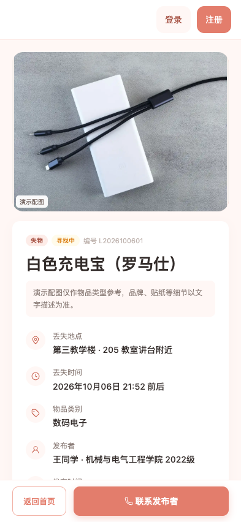
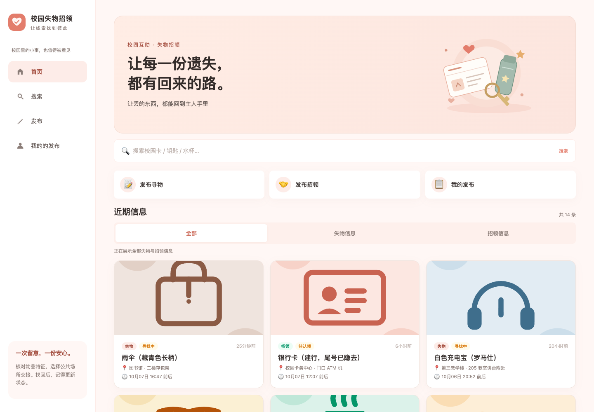
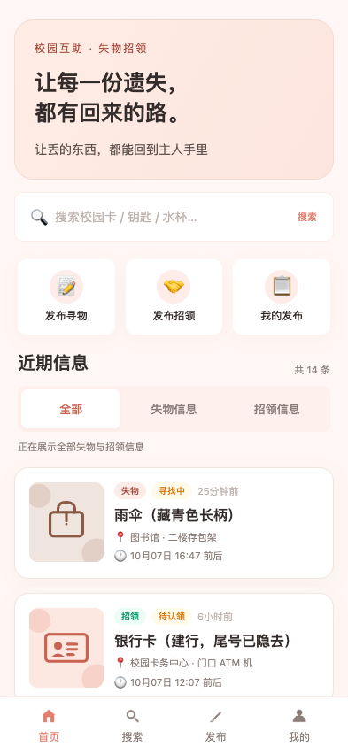
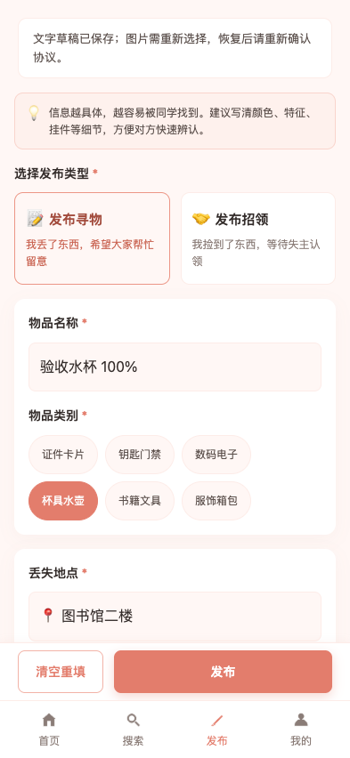
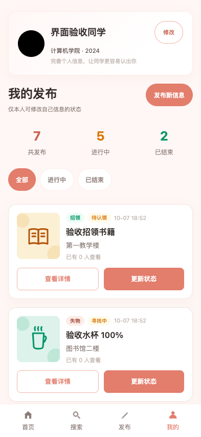
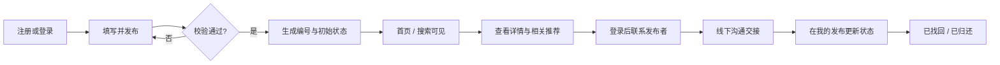
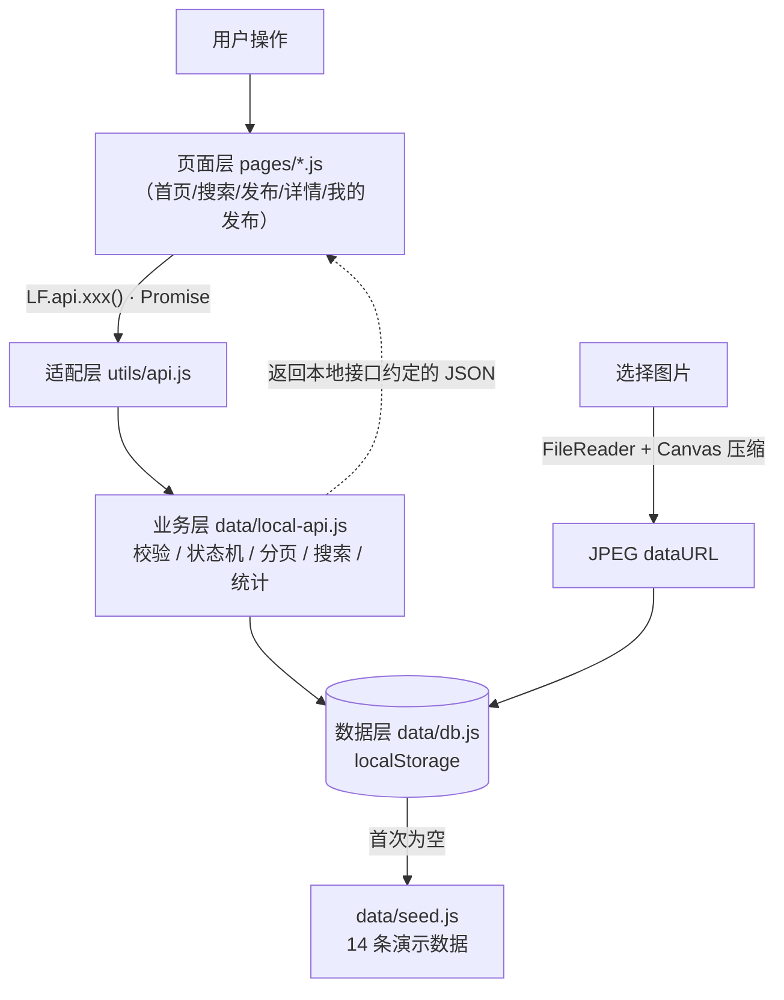
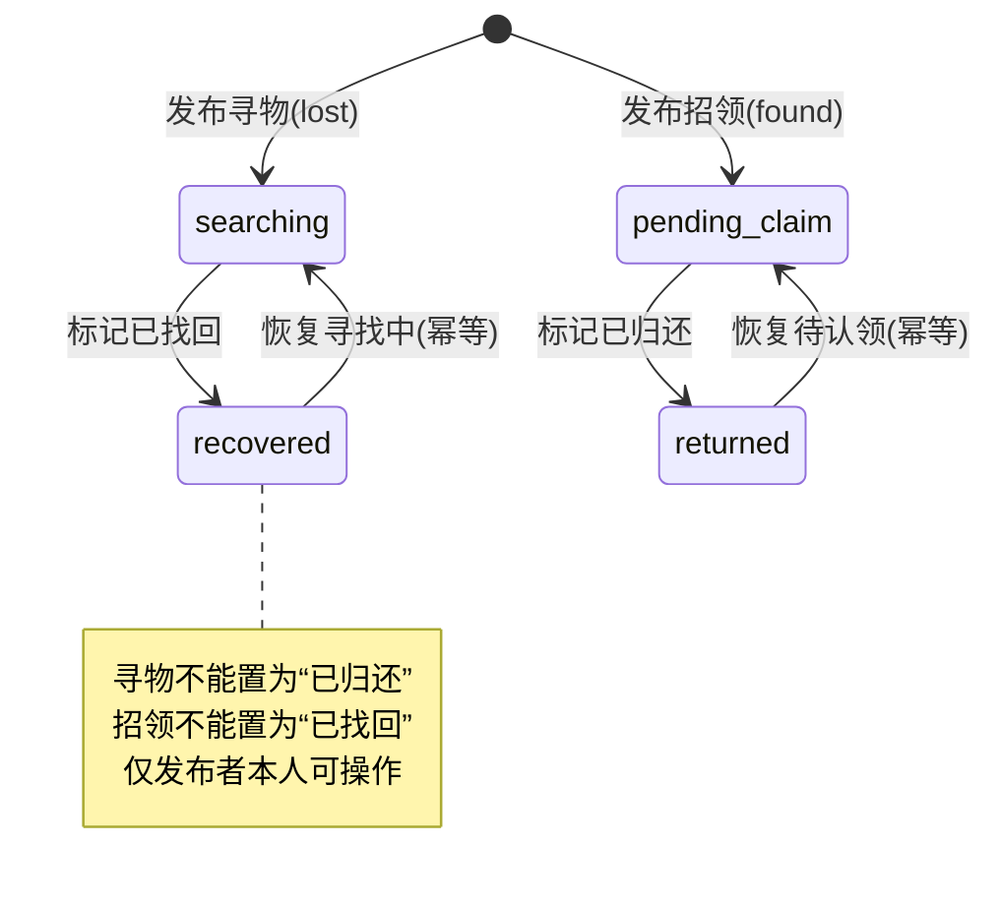

<a id="readme-top"></a>

<div align="center">

<!-- 可选：把一张横幅图命名为 docs/banner.png 后取消下一行注释 -->
<!--  -->

<h1>🏫 校园失物招领平台</h1>

<h3>丢了东西有人帮，捡到东西能归还 —— 一个开箱即用、零后端依赖的 Web 版校园失物招领</h3>

<p>
  
  
  
  = 18" />
  
  
</p>

<p>
  
  
  
  
  <a href="LICENSE"></a>
</p>

<p>
  <a href="#features">功能特性</a> ·
  <a href="#quick-start">快速开始</a> ·
  <a href="#architecture">项目架构</a> ·
  <a href="#directory">目录结构</a> ·
  <a href="#testing">单元测试</a> ·
  <a href="#api-map">接口对照</a>
</p>
</div>

---

## 📖 项目简介

这是《软件工程》课程**第二次结对作业（程序实现）**的 Web 端作品，实现了「**发布信息 → 浏览 / 搜索 → 查看详情 → 联系发布者 → 更新状态**」的完整失物招领闭环。

[项目仓库](https://github.com/5-bin/102401632-102401633) · [作业随笔草稿](作业随笔.md) · [提交前审查与验证](docs/提交前审查与验证.md)

为了让老师和同学**下载后无需配置 JDK / 数据库、用浏览器打开就能看到预期效果**，本版本在保留真实前后端分离项目的页面流程与业务规则的前提下，用一层「**浏览器内本地数据层**」提供本地演示功能：

- 🚫 **无需启动后端、无需数据库、无需 `npm install`**；
- 💾 数据通过 **localStorage** 持久化，刷新不丢失、不联网；
- 🔌 页面只面向统一的 `LF.api` 接口编程，页面通过同一适配层调用本地业务；接入现有 Java 后端需要另外实现字段、登录与图片上传适配（详见[架构说明](#architecture)）。

> 采用响应式单页应用（hash 路由），电脑侧栏、平板顶部导航、手机底部导航。开发与演示统一使用 **Google Chrome**。数据只保存在当前浏览器，不跨设备共享。

---

## 邮箱登录与原地弹窗（2026-10-07）

- 修正导航文案：桌面使用“我的发布”，手机保留“我的”；统一使用“登录”。
- 注册填写昵称、邮箱与 8–64 字符密码，登录使用邮箱和密码。首页、搜索与详情允许游客浏览；发布、我的发布、个人资料、状态更新与联系方式需要登录。
- 未登录点击发布、我的发布或联系发布者，在当前页面弹出登录框，保留地址、搜索条件、滚动位置与导航选中状态。登录成功继续原操作；账号栏登录／注册完成后留在原页。
- 关闭按钮、遮罩和 Esc 均可取消并恢复触发控件焦点。登录／注册原地切换，保留邮箱、清除密码；弹窗限制背景操作，支持滚动和减少动态效果设置。
- 直接打开受限地址显示对应页面的“需要登录”占位；主动退出后保留占位，由用户重新登录。会话到期先隐藏私人内容，再原地提示登录；关闭或切换页面取消未完成的账号请求。
- 保留独立 `#/auth` 地址，与弹窗复用同一表单。`LF.auth.requestLogin(next, { mode, onSuccess })` 保存目标或成功回调；联系方式通过回调自动打开，账号入口只更新账号显示。
- 首次注册须确认绑定当前浏览器的旧资料和发布记录，保留用户编号及上传图片；后续账号拥有独立发布列表和文字草稿。
- 账号保存在 localStorage，密码使用独立随机盐和 PBKDF2-HMAC-SHA-256 校验值，不保存明文。会话存入 sessionStorage，24 小时过期，刷新保留；关闭标签页后需重新登录。
- 账号只在当前浏览器和访问地址下有效。`file://`、`localhost`、`127.0.0.1` 或不同端口不能当作同一数据空间；清除网站存储会丢失本地账号、信息和草稿。不提供邮箱验证或密码找回。
- 账号存储和绑定说明见 [离线登录与验证](docs/离线登录与验证.md)；当前弹窗交互、Chrome 验收结果和复现步骤见 [原地登录弹窗验证](docs/原地登录弹窗验证.md)。


<a id="features"></a>

## 图标与物品配图更新（2026-10-07）

- 六个页面及弹窗统一使用本地 Lucide 线条图标，导航选中颜色、关闭与上传按钮一致。
- 14 条演示信息分别使用 8 张实物参考照片和 6 张物品示意图，修正雨伞、充电宝等错配。配图标记为“演示配图”，品牌、贴纸等细节以文字描述为准。
- 素材全部本地化，离线可用；旧浏览器记录无需重置，用户上传图片不会被替换。图片失效时依次退回类别示意图和内联图标。
- 素材作者与许可见 [来源说明](assets/SOURCES.md)，实现与验收见 [图标配图优化与验证](docs/图标配图优化与验证.md)。


<p align="center">
  
  
  
</p>

## 本轮优化（2026-10-07）

- 六个页面适配电脑、平板和手机，移除模拟手机外框并允许页面缩放。
- 搜索支持关键词、类型、类别、地点和状态组合筛选，提供最新发布、最早发布、最近发生三种排序；条件保存在地址栏。
- 发布文字草稿自动保存、刷新恢复；图片需重新选择，协议需重新确认。成功发布后清除草稿，失败时保留填写内容。
- 修复分页滚动位置、旧请求结果覆盖、个人页弹层被刷新关闭、复制失败误报成功，以及本地保存失败后出现临时记录的问题。
- 桌面 ≥1024px 使用侧栏；列表 <640px 单列、640–1279px 双列、≥1280px 三列。手机详情和成功页使用返回与主要操作条。



<p align="center">
  
  
  
</p>

完整改动、接口参数、测试结果与验证边界见 [本轮优化与验证](docs/本轮优化与验证.md)。以下保留旧版截图，不能作为本轮页面效果依据。

## 📸 历史版本效果展示

<p align="center">
   &nbsp;
   &nbsp;
  
</p>
<p align="center">
   &nbsp;
   &nbsp;
  
</p>

<div align="center">
<sub>首页　·　详情　·　发布　·　联系发布者　·　发布成功　·　我的发布</sub>
</div>

## ✨ 功能特性

<table>
<tr>
<td valign="top" width="50%">

<h4>🔍 浏览与搜索</h4>
<ul>
<li>首页<b>失物 / 招领</b>分类切换、触底分页加载</li>
<li>关键词匹配<b>名称 / 地点 / 描述 / 编号</b>，支持类别、地点和状态组合筛选及三种排序</li>
<li>热门搜索词、空结果推荐与引导</li>
</ul>
</td>
<td valign="top" width="50%">

<h4>📄 详情与推荐</h4>
<ul>
<li>图片<b>轮播预览</b>，点击查看大图</li>
<li>浏览量统计、同类型<b>相关推荐</b>（进行中优先）</li>
<li>证件类物品<b>隐私提示</b>，提示发布者遮挡姓名、学号与完整号码（不自动识别或脱敏图片）</li>
</ul>
</td>
</tr>
<tr>
<td valign="top">

<h4>📝 发布信息</h4>
<ul>
<li>寻物 / 招领两种类型，6 大物品类别</li>
<li>必填校验、时间合法性校验、协议确认、文字草稿恢复</li>
<li>图片本地上传，<b>Canvas 自动压缩</b>（最长边 900px）</li>
<li>自动生成信息编号 <code>L/F + yyyyMMdd + 序号</code></li>
</ul>

</td>
<td valign="top">

<h4>📞 联系与状态流转</h4>
<ul>
<li>登录后点击才展示联系方式；本地展示控制不能替代服务器隐私鉴权</li>
<li>微信号一键复制、手机号一键拨打</li>
<li>状态机校验：寻物「寻找中↔已找回」、招领「待认领↔已归还」</li>
<li>仅发布者本人可改状态，操作幂等</li>
</ul>

</td>
</tr>
<tr>
<td valign="top">

<h4>👤 个人中心</h4>
<ul>
<li>「我的发布」总数 / 进行中 / 已结束统计</li>
<li>按状态筛选、一键切换信息状态</li>
<li>昵称、学院、年级、头像资料维护</li>
</ul>
</td>
<td valign="top">

<h4>🧰 工程化</h4>
<ul>
<li>页面 / 业务 / 数据<b>三层解耦</b></li>
<li>内置 14 条演示数据，时间相对当前动态生成</li>
<li>一键重置演示数据</li>
<li>100 个自动化单元测试，覆盖账号、核心逻辑和演示素材兼容</li>
</ul>

</td>
</tr>
</table>

---

## 🛠 技术栈

| 分类 | 选型 | 说明 |
| --- | --- | --- |
| 结构 / 样式 / 交互 | **原生 HTML5 + CSS3 + JavaScript** | 无任何前端框架，hash 路由手写 |
| 本地持久化 | **localStorage** | 键名 `lf_local_db_v1`，自增主键、按天生成编号 |
| 图片处理 | **FileReader + Canvas** | 等比缩放、铺白底转 JPEG dataURL，不依赖服务器 |
| 静态服务 | **Node.js 零依赖** `server.js` | 仅托管静态文件，可选使用 |
| 单元测试 | **`node:test` + `node:assert/strict`** | Node ≥ 18 内置，零第三方依赖 |
| 设计稿来源 | 第一次作业原型 | 响应式单页，珊瑚橙主题 |

---

<a id="quick-start"></a>

## 🚀 快速开始

### 环境要求

- 一个现代浏览器（推荐 **Chrome**）；
- 可选：[Node.js](https://nodejs.org/) **18 及以上**（仅方式一需要，且无需安装任何依赖）。

### 方式一：Node 静态服务器（推荐）

```bash
# 进入项目目录
cd lost-found

# 启动零依赖静态服务器（默认 8090 端口）
node server.js

# 如需自定义端口：node server.js 3000
```

浏览器打开 👉 <http://localhost:8090>。静态服务器仅监听 `127.0.0.1`，用于本机预览。换端口时使用实际端口访问。

### 方式二：直接打开

双击根目录下的 **`index.html`**，用 Chrome 打开即可运行。
若个别浏览器对 `file://` 协议的本地存储有限制导致异常，请改用方式一。

### 🧭 核心使用流程



---

<a id="architecture"></a>

## 🏗 项目架构

### 分层设计

页面只依赖统一接口 `LF.api`，并不感知数据来自网络还是本地。当前实现把该接口转发给浏览器内的数据层。它保留本地版本的方法签名和分页结构，新增搜索参数向后兼容。本地版与上级目录现有 Java 后端的账号、类别、状态枚举、分页和图片协议存在差异，不能直接切换转发目标完成接入。



### 信息状态机

状态流转在业务层强校验，也是单元测试中「状态迁移测试」的依据：



### 设计亮点

- **面向接口编程**：本地调用采用 camelCase 字段和 `records/page/pageSize/total/pages/hasNext` 分页结构；页面统一依赖 `LF.api`；
- **业务规则集中**：校验、状态机、统计都收敛在 `local-api.js`，视图层轻薄、可测试性强；
- **图片本地化**：Canvas 压缩 + dataURL，兼顾「能发图」与「不撑爆 localStorage」。

---

<a id="directory"></a>

## 📁 目录结构

```
lost-found/
├─ index.html                  # 单页应用入口（按序加载脚本）
├─ server.js                   # 零依赖 Node 静态服务器（可选）
├─ README.md                   # 本文档
├─ LICENSE                     # 项目代码的 MIT 许可证
├─ assets/
│  ├─ tabbar/                  # 历史导航 PNG，保留
│  ├─ icons/lucide/            # 本地图标子集、完整许可证与固定版本
│  ├─ items/                   # 原分类 SVG + photos 实物参考图 + illustrations 示意图
│  └─ logo.svg / hero.svg       # 复用上级 frontend 的项目素材
├─ css/                        # global + 各页面作用域样式 + responsive
├─ js/
│  ├─ config.js                # 全局配置（已去除后端地址）
│  ├─ app.js                   # hash 路由与启动入口
│  ├─ data/                    # 
│  │  ├─ seed.js               #   演示数据（时间相对当前动态生成）
│  │  ├─ db.js                 #   localStorage 数据库 / 主键 / 编号
│  │  ├─ accounts.js           #   邮箱账号、密码校验、会话和旧资料绑定
│  │  └─ local-api.js          #   本地业务、组合搜索、失败回滚
│  ├─ utils/
│  │  ├─ icons.js / media.js    # SVG 白名单与只读演示配图映射
│  │  ├─ api.js                # 适配层：转发到 LF.localApi
│  │  ├─ draft.js / query.js    # 文字草稿与地址栏条件
│  │  ├─ request.js            # 原 fetch 远程请求（已停用，保留说明）
│  │  ├─ auth.js               # 会话身份 / 登录入口
│  │  ├─ format.js  url.js  ui.js  constants.js
│  ├─ components/tabbar.js     # 电脑侧栏 / 平板与手机导航
│  └─ pages/                   # auth / home / search / publish / detail / success / my-posts
└─ 单元测试/
   ├─ package.json             # npm test 入口
   ├─ tests/
      ├─ helpers/env.js        # vm 沙箱 + 内存 localStorage
      ├─ accounts.test.js      # 注册、会话、隔离、绑定和失败回滚
      ├─ auth-navigation.test.js # 登录目标、弹窗续接及会话事件
      ├─ local-api.test.js     # 核心业务测试
      ├─ db.test.js            # 数据库工具测试
      ├─ utils.test.js         # 工具函数测试
      ├─ media.test.js         # 演示配图、用户图片保留与白名单
      └─ responsive-features.test.js # 本轮 15 项业务回归
   ├─ browser-check.cjs        # 可选 Chrome 业务验收（另需 Playwright）
   ├─ auth-browser-check.cjs   # 本轮账号及全部回归，临时服务自动关闭
   └─ media-browser-check.cjs  # 图标、配图、离线与回退验收（另需 Playwright）
```

---

<a id="testing"></a>

## ✅ 单元测试

测试框架选用 Node.js **内置的 `node:test`**（BDD 风格的 `describe / it / beforeEach`，与 Mocha 一致），配合内置断言 `node:assert/strict`，**无需 `npm install`、一条命令即可运行**，天然适合自动化与每日构建。

```bash
cd "单元测试"

npm test            # 运行全部用例（等价于 node --test tests/*.test.js）
npm run test:detail # spec 风格的详细输出
```

<div align="center">

```
# tests 100
# suites 18
# pass 100
# fail 0
```

</div>

2026-10-07 对当前本地版本实际执行 `node --test tests/*.test.js`：7 个测试文件，100 项测试通过，18 个套件，0 失败。环境没有 npm，使用已有 Node 执行上述等价入口。完整浏览器回归脚本与实机手机验收本次**未运行**；此前截图和报告属于历史验收记录。验证范围及尚未修复的问题见 [提交前审查与验证](docs/提交前审查与验证.md)。

被测的浏览器脚本通过 `tests/helpers/env.js` 中的 **`vm` 沙箱 + 内存版 localStorage** 加载，在 Node 中即可测试业务逻辑，无需浏览器与第三方依赖。用例以**白盒方法**设计：

- **等价类划分**：失物 / 招领、本人 / 他人 / 匿名、微信 / 手机号；
- **边界值分析**：分页 `pageSize`（0 / 1 / 20 / 999）、图片数量与大小、未来时间、编号跨天序号；
- **状态迁移测试**：四条合法迁移 + 两条非法跨类型迁移 + 幂等；
- **权限与安全**：匿名取联系方式、非发布者改状态均被拒绝；
- **错误推测**：空关键词、无结果、不存在的 id、漏填必填项等异常路径。

---

## 💾 演示数据与图片

- 所有数据保存在浏览器 **localStorage**（键 `lf_local_db_v1`），发布、状态变更、资料修改刷新后依然存在；
- **恢复初始演示数据**：此操作会删除当前浏览器的发布记录和资料；需要保留时先备份。确认清空后，在浏览器控制台执行

  ```js
  LF.localApi.resetDemo().then(() => location.reload());
  ```

- 用户上传图片经 Canvas 等比压缩至最长边 **900px**、铺白底转 JPEG（dataURL）后随记录存储。存储配额因浏览器而异；不足时减少图片数量或换用更小的图片，失败不会残留新记录。文字草稿按账号保存在数据库的 `drafts` 中，不保存图片和协议；旧 `lf_publish_draft_v1` 在首次注册绑定时导入，原键保留。

---

<a id="api-map"></a>

### 搜索与草稿接口

`LF.api.searchItems(params)` 新增 `categoryCode`、`location`、`status`（`all/ongoing/closed`）和 `sort`（`newest/oldest/occurred`）；原 `keyword/type/page/pageSize` 和返回结构保持兼容。多条件取交集，省略条件时维持原默认行为。

`LF.draft.load()` 读取当前账号的文字草稿，`save(form)` 保存允许的文字字段，`clear()` 清除草稿。页面自动保存间隔约 500ms，离开页面时补充保存。已有草稿的类型优先于首页预设类型；浏览器关闭或强制退出前最后一次输入可能来不及持久化，请留意保存提示。

---

## ⚠️ 说明与限制

本项目是**单机演示实现**：账号、发布记录与草稿仅存于当前浏览器，离线权限校验不能替代后端认证。能够修改浏览器存储或脚本的人仍可绕过本地权限，不提供跨设备同步、服务器权限保护或多人并发保证，**请勿直接用于生产环境**。

## 许可证与交付待办

项目代码采用 [MIT License](LICENSE)。许可证正文参照 [Open Source Initiative](https://opensource.org/license/mit)。第三方图标与照片沿用各自许可，不因项目代码采用 MIT 而改变；作者、来源和许可见 [素材来源](assets/SOURCES.md)。

作业随笔仍需两位同学填写真实身份、博客链接、分工、PSP 耗时、队友评价和个人总结，并补真实 Git 签入截图。现有分工和耗时是未核实草稿，不能作为已经完成的协作证据。

---


<div align="center">
  <sub>如果这个项目对你有帮助，欢迎 ⭐ Star 支持一下～</sub><br/>
  <a href="#readme-top">🔼 返回顶部</a>
</div>
