<a id="readme-top"></a>

<div align="center">

<h1>🏫 校园失物招领平台</h1>

<h3>丢了东西有人帮，捡到东西能归还 —— 一套零后端、零安装、双击即跑的校园失物招领，同时交付 <b>响应式 Web 端</b> 与 <b>Android App（APK）</b></h3>

<p>
  
  
  
  = 18" />
  
  
</p>

<p>
  
  
  
  
  
  
</p>

<p>
  <a href="#one-minute">⚡ 一分钟跑起来</a> ·
  <a href="#features">功能特性</a> ·
  <a href="#quick-start">快速开始</a> ·
  <a href="#directory">目录结构</a> ·
  <a href="#architecture">项目架构</a> ·
  <a href="#testing">单元测试</a> ·
  <a href="#apk">APK 说明</a>
</p>
</div>

---

## 📖 项目简介

这是《软件工程》课程第二次结对作业（程序实现）的作品，实现了「**发布信息 → 浏览 / 搜索 → 查看详情 → 联系发布者 → 更新状态**」的完整失物招领闭环。

项目最初以 **Web 页面模拟手机 App** 的方式开发（移动端单页 + 桌面浏览器手机外壳）；随后把这套前端代码用一个极薄的 **Android WebView 壳工程**原样打包成可安装的 APK；同时又在此基础上完善出一套桌面 / 平板 / 手机自适应的 **响应式 Web 端**。因此仓库中包含两个同源的交付物：

| 目录 | 交付形态 | 运行方式 | 说明 |
| --- | --- | --- | --- |
| [`web/`](web/) | **Web 端** | Chrome 打开 `web/index.html` 或 `node server.js` | 响应式布局（桌面侧边导航 / 移动端单栏 + Tab），含独立登录注册页、会话管理、实物配图等增强 |
| [`mobile/`](mobile/) | **Android App 端** | [**下载安装 app.apk**](https://github.com/Clu3y/102401632-102401633/releases/download/v1.0.0/app.apk)，或浏览器预览 | 最初的手机形态版本；APK 由该目录源码打包，**离线可运行** |

为了让老师和同学**下载后无需配置 JDK / 数据库、无需 `npm install` 就能看到预期效果**，两端在保留真实前后端分离项目的页面、接口契约与业务规则的前提下，用一层「**浏览器内本地数据层**」替代了远程后端：

- 🚫 **无需启动后端、无需数据库、无需安装任何依赖**；
- 💾 数据通过 **localStorage** 持久化，刷新不丢失、不联网；
- 🔌 页面只面向统一的 `LF.api` 接口编程，将来接回真实后端时**页面零改动**（详见[架构说明](#architecture)）。

> 🧪 Web 端开发与演示统一使用 **Google Chrome**；App 端安装包可直接在安卓手机运行。

<a id="one-minute"></a>

## ⚡ 一分钟跑起来

<div align="center">

<p>
💻 <b>Web 端（零安装）</b>：下载本仓库后，直接双击 <a href="web/index.html"><b><code>web/index.html</code></b></a>，用 Chrome 打开即可运行，无需 Node、无需 <code>npm install</code>。
</p>

<p>
📱 <b>Android 手机端</b>：在手机上点击 👉 <a href="https://github.com/Clu3y/102401632-102401633/releases/download/v1.0.0/app.apk"><b>下载 app.apk（v1.0.0，约 97 KB）</b></a>，下载完成后点击安装（首次需允许「安装未知来源应用」），桌面出现「校园失物招领」图标后即可离线使用。
</p>

</div>

---

## 📸 效果展示

### 💻 Web 端

<p align="center">
   &nbsp;
  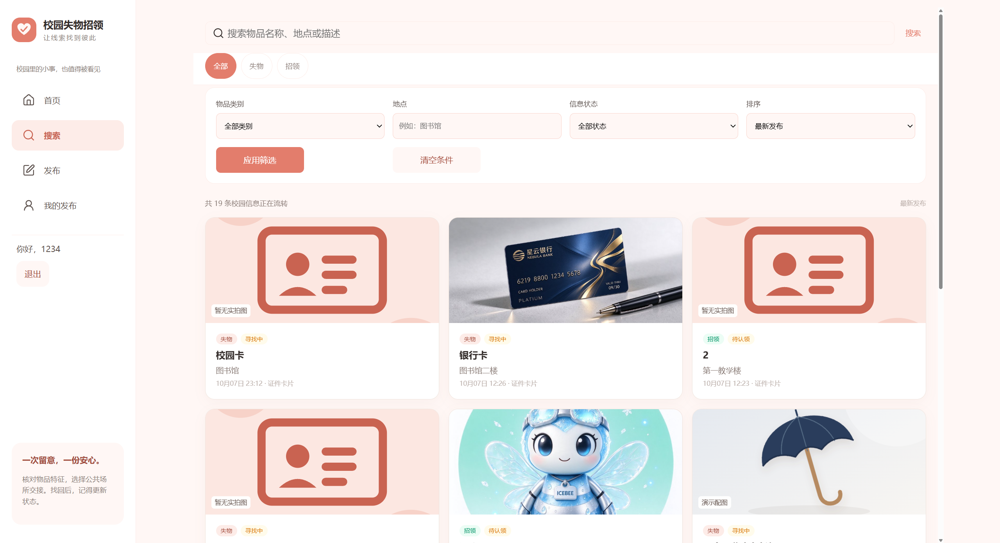 &nbsp;
  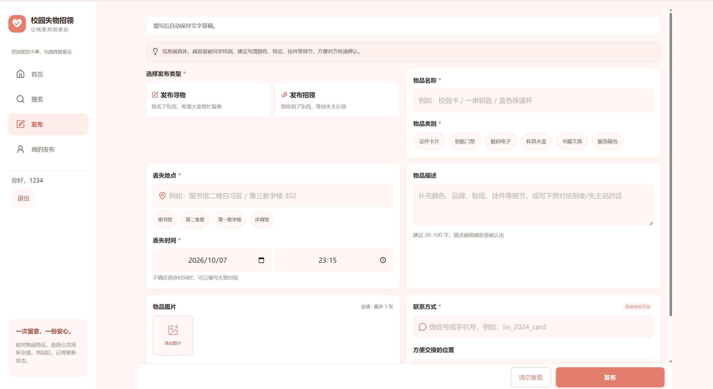
</p>
<p align="center">
  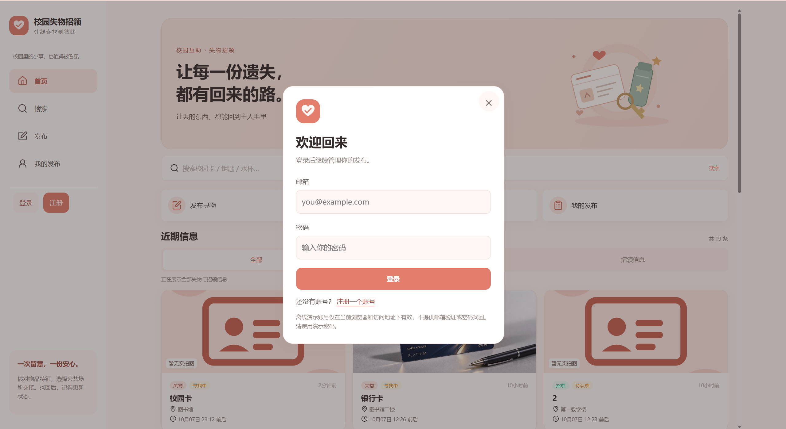 &nbsp;
  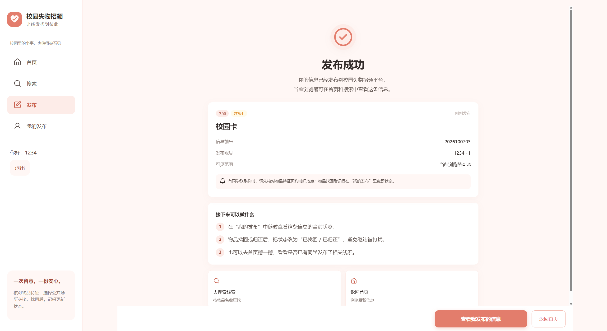 &nbsp;
  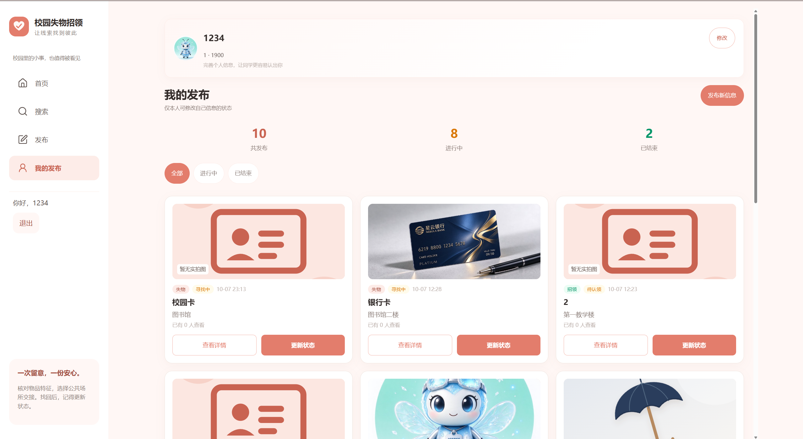
</p>

<div align="center">
<sub>首页　·　搜索　·　发布　·　登录 / 注册　·　发布成功　·　我的发布</sub>
</div>

### 📱 Android App 端（真机截图）

<p align="center">
  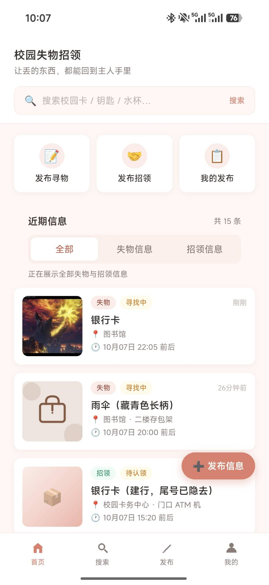 &nbsp;
  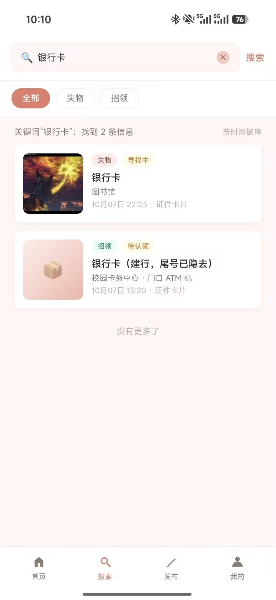 &nbsp;
  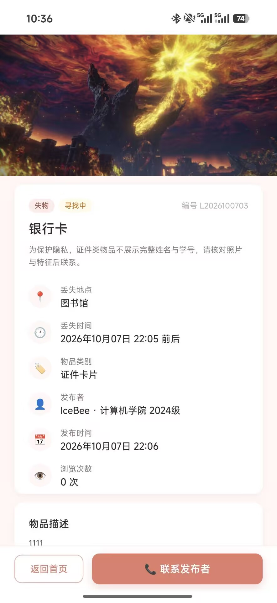 &nbsp;
  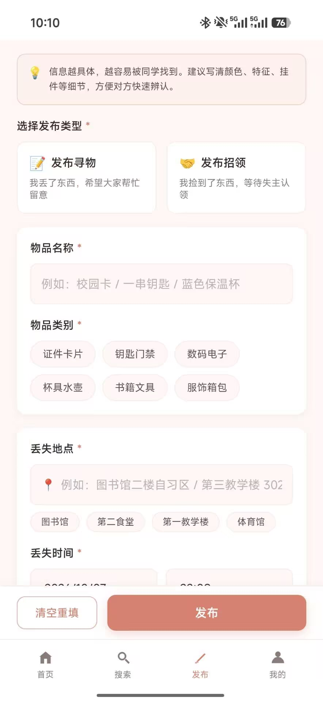
</p>
<p align="center">
  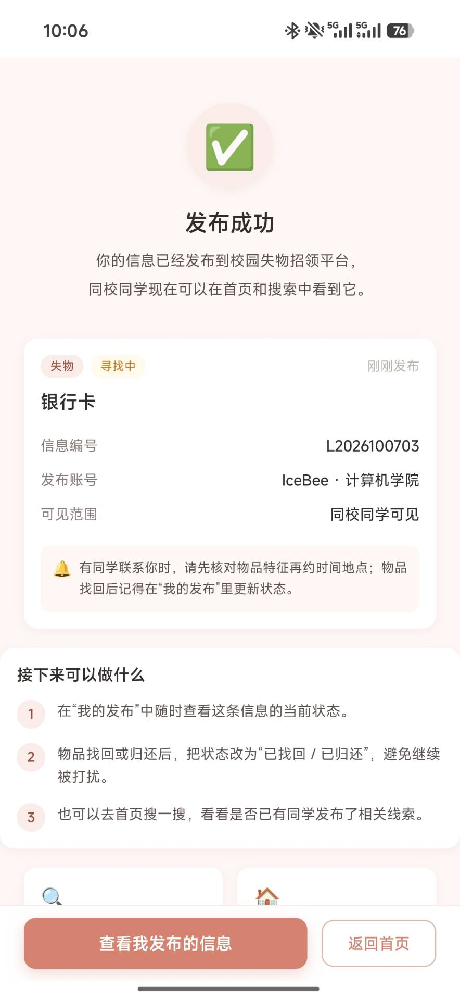 &nbsp;
  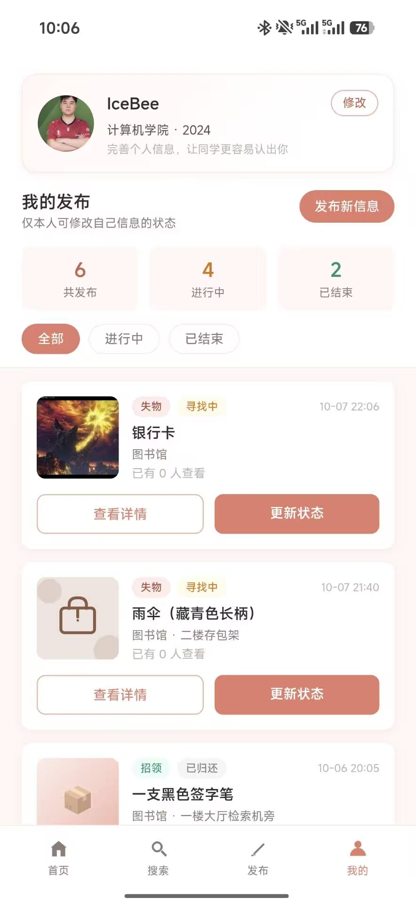 &nbsp;
  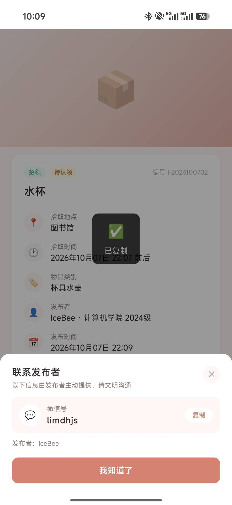 &nbsp;
  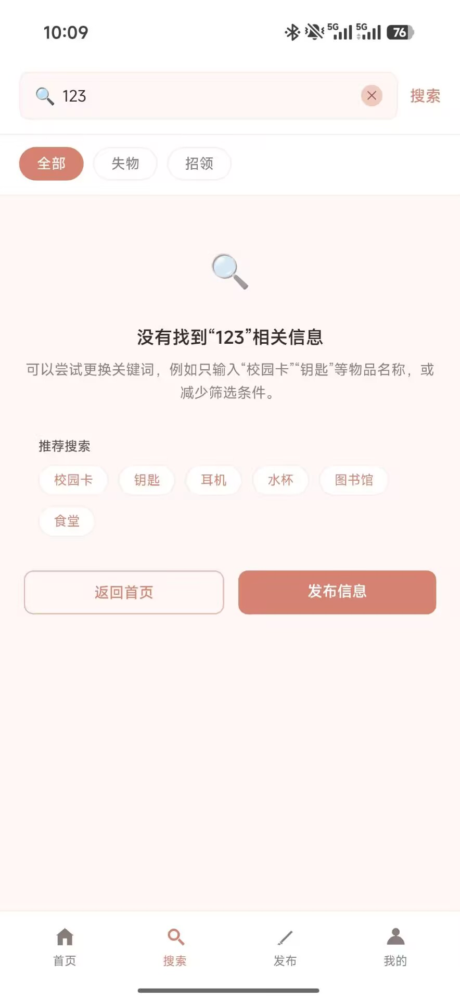
</p>

<div align="center">
<sub>首页　·　搜索　·　详情与相关推荐　·　发布　·　发布成功　·　我的发布　·　联系发布者　·　空结果引导</sub>
</div>

<a id="features"></a>

## ✨ 功能特性

<table>
<tr>
<td valign="top" width="50%">

<h4>🔍 浏览与搜索</h4>
<ul>
<li>首页<b>失物 / 招领</b>分类切换、触底分页加载</li>
<li>关键词同时匹配<b>名称 / 地点 / 描述 / 编号</b>，自动去除首尾空格</li>
<li>热门搜索词、空结果推荐与引导</li>
</ul>
</td>
<td valign="top" width="50%">

<h4>📄 详情与推荐</h4>
<ul>
<li>图片<b>轮播预览</b>，点击查看大图</li>
<li>浏览量统计、同类型<b>相关推荐</b>（进行中优先）</li>
<li>证件类物品<b>隐私提示</b>，敏感信息脱敏</li>
</ul>
</td>
</tr>
<tr>
<td valign="top">

<h4>📝 发布信息</h4>
<ul>
<li>寻物 / 招领两种类型，6 大物品类别</li>
<li>必填校验、时间合法性校验、协议确认</li>
<li>图片本地上传，<b>Canvas 自动压缩</b>（最长边 900px）</li>
<li>自动生成信息编号 <code>L/F + yyyyMMdd + 序号</code></li>
</ul>
</td>
<td valign="top">

<h4>📞 联系与状态流转</h4>
<ul>
<li>联系方式<b>点击后才可见</b>，保护隐私</li>
<li>微信号一键复制、手机号一键拨打</li>
<li>状态机校验：寻物「寻找中↔已找回」、招领「待认领↔已归还」</li>
<li>仅发布者本人可改状态，操作幂等</li>
</ul>
</td>
</tr>
<tr>
<td valign="top">

<h4>👤 个人中心</h4>
<ul>
<li>「我的发布」总数 / 进行中 / 已结束统计</li>
<li>按状态筛选、一键切换信息状态</li>
<li>昵称、学院、年级、头像资料维护</li>
</ul>
</td>
<td valign="top">

<h4>🧰 工程化与双端</h4>
<ul>
<li>页面 / 业务 / 数据<b>三层解耦</b>，Web 与 App <b>共用同一套业务核心</b></li>
<li>内置 14 条演示数据，时间相对当前动态生成，一键重置</li>
<li>Web 端：响应式布局、独立登录注册页、会话过期与路由门禁、草稿恢复、无障碍跳转链接</li>
<li>App 端：WebView 壳打包为 APK，离线可运行</li>
</ul>
</td>
</tr>
</table>

---

## 🛠 技术栈

| 分类 | 选型 | 说明 |
| --- | --- | --- |
| 结构 / 样式 / 交互 | **原生 HTML5 + CSS3 + JavaScript (ES5)** | 无任何前端框架，hash 路由手写 |
| 本地持久化 | **localStorage** | 键名 `lf_local_db_v1`，自增主键、按天生成编号 |
| 图片处理 | **FileReader + Canvas** | 等比缩放、铺白底转 JPEG dataURL，不依赖服务器 |
| Android 打包 | **原生 WebView 壳工程** | APK 内 `assets/www/` 即 `mobile/` 前端源码，AGP 8.7.2 构建 |
| 静态服务 | **Node.js 零依赖** `server.js` | 仅托管静态文件，可选使用 |
| 单元测试 | **`node:test` + `node:assert/strict`** | Node ≥ 18 内置，零第三方依赖 |
| 设计稿来源 | 第一次作业原型 | 移动端单页，珊瑚橙主题 |

---

<a id="quick-start"></a>

## 🚀 快速开始

### A. Web 端（推荐 Chrome）

**方式一：双击 `index.html` 启动（最简单，推荐）**

下载本仓库后，直接双击 **[`web/index.html`](web/index.html)**，用 Chrome 打开即可运行；无需 Node、无需安装任何依赖。若个别浏览器对 `file://` 协议的本地存储有限制导致异常，请改用方式二。

**方式二：Node 零依赖静态服务器**

```bash
cd web
node server.js          # 默认 8090 端口；自定义端口：node server.js 3000
```

浏览器打开 👉 <http://localhost:8090>（需要 Node.js 18+，同样无需 `npm install`）。

### B. Android App 端（APK）

📲 **下载安装包**：[**app.apk（v1.0.0，约 97 KB）**](https://github.com/Clu3y/102401632-102401633/releases/download/v1.0.0/app.apk)　·　[查看全部 Release](https://github.com/Clu3y/102401632-102401633/releases)

1. 在安卓手机上点击上面的链接下载 `app.apk`（仓库内也同步保留了一份 [`mobile/apk/app.apk`](mobile/apk/app.apk)）；
2. 点击安装，首次需在系统设置中允许「安装未知来源应用」；
3. 桌面出现「校园失物招领」图标，**离线即可运行**。

> 想先在电脑上预览手机界面：`cd mobile && node server.js 8091`，浏览器打开 <http://localhost:8091>（桌面浏览器会显示居中的手机外壳）。

### C. 环境要求

- Web 端：一个现代浏览器（推荐 **Chrome**）；可选 [Node.js](https://nodejs.org/) **18+**（仅静态服务器与跑测试需要，无需安装依赖）；
- App 端：一部安卓手机（直接装 APK），无需任何环境。

### 🧭 核心使用流程

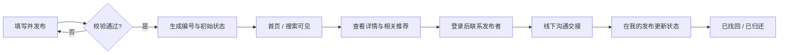

---

<a id="directory"></a>

## 📁 目录结构

```
lost-found/
├─ README.md                  # 本文档（双端总说明）
├─ LICENSE                    # MIT（两端同源代码）
├─ docs/
│  └─ screenshots/
│     ├─ web/                 # Web 端展示截图（6 张）
│     └─ mobile/              # Android App 真机截图（8 张）
├─ web/                       # ===== Web 端（响应式）=====
│  ├─ index.html              # 单页应用入口
│  ├─ server.js               # 零依赖静态服务器（可选，默认 8090）
│  ├─ README.md  LICENSE  .gitignore
│  ├─ assets/                 # tabbar 图标、分类图、lucide 图标、实物配图与插画
│  ├─ css/                    # global + 各页面样式 + responsive/media 响应式 + auth
│  ├─ js/
│  │  ├─ config.js  app.js    # 全局配置 / hash 路由与启动
│  │  ├─ data/                # seed 演示数据 / db(localStorage) / accounts 账号 / local-api 业务层
│  │  ├─ utils/               # api 适配层、auth、ui、icons、media、draft、query、format 等
│  │  ├─ components/tabbar.js # 底部导航
│  │  └─ pages/               # auth 登录注册 / home / search / publish / detail / success / my-posts
│  ├─ docs/                   # 开发与提交流程的验证记录、回归截图（过程材料）
│  └─ 单元测试/                # 7 个测试文件（含 accounts/auth/media/responsive 等）
└─ mobile/                    # ===== Android App 端（手机形态）=====
   ├─ index.html              # 单页应用入口（桌面端含手机状态栏外壳）
   ├─ server.js               # 零依赖静态服务器（浏览器预览用，建议 8091）
   ├─ README.md  LICENSE
   ├─ apk/
   │  └─ app.apk              # ★ Android 安装包（WebView 壳 + assets/www）
   ├─ assets/                 # tabbar 图标、6 类分类图
   ├─ css/                    # global（含手机外壳）+ 各页面样式
   ├─ js/
   │  ├─ config.js  app.js    # 全局配置 / hash 路由与启动（首启匿名静默登录）
   │  ├─ data/                # seed / db(localStorage) / local-api
   │  ├─ utils/               # api 适配层、auth、ui、format、url 等
   │  ├─ components/tabbar.js
   │  └─ pages/               # home / search / publish / detail / success / my-posts
   └─ 单元测试/                # 3 个测试文件（local-api / db / utils）
```

> `作业要求.md`、`作业随笔.md` 为作业与博客草稿材料，已在 `.gitignore` 中忽略，不进入 GitHub 仓库。

---

<a id="architecture"></a>

## 🏗 项目架构

### 分层设计（Web 端与 App 端一致）

页面只依赖统一接口 `LF.api`，并不感知数据来自网络还是本地。当前实现把该接口转发给浏览器内的数据层；将来接回真实后端时，只需把 `js/utils/api.js` 的转发目标换回 HTTP 请求，**页面与业务代码零改动**。


### 信息状态机

状态流转在业务层强校验，也是单元测试中「状态迁移测试」的依据：

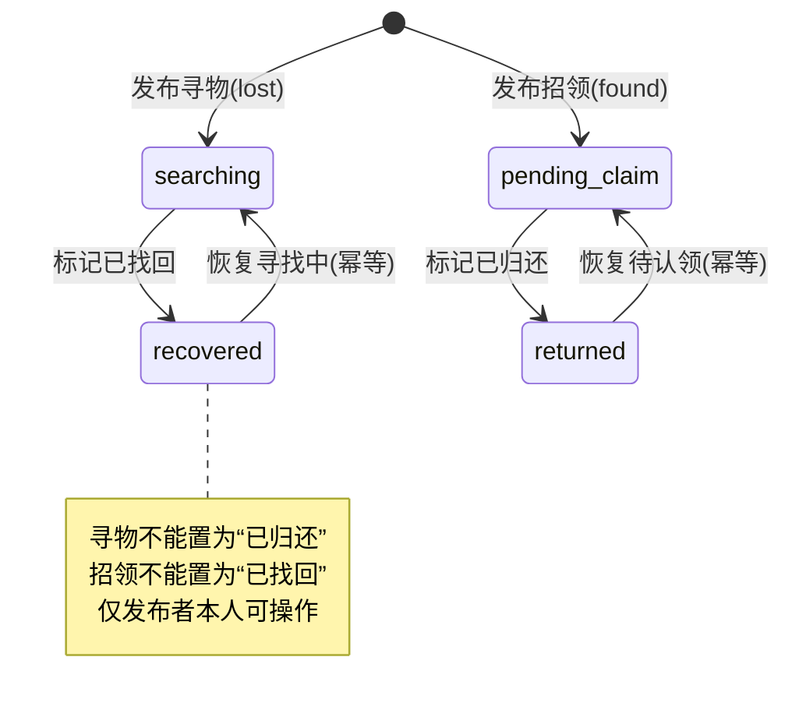

### 两端差异

| 维度 | Web 端（`web/`） | App 端（`mobile/`） |
| --- | --- | --- |
| 布局 | 桌面侧边导航，平板 / 手机自适应（`responsive.css`、`media.css`） | 固定手机形态，桌面浏览器显示手机外壳 |
| 登录 | 独立登录 / 注册页、账号库、会话过期、路由门禁、草稿恢复 | 首次访问匿名静默登录，弹窗中补昵称 |
| 素材 | lucide 图标、实物配图（webp）、插画、Logo / Hero | 6 张分类 SVG + Tab 图标，保持安装包轻量 |
| 交付 | 网页源码 | 网页源码 + 安装好的 `apk/app.apk` |
| 自动化测试 | 7 个测试文件 / **100** 个用例 | 3 个测试文件 / **58** 个用例 |

### 设计亮点

- **面向接口编程**：方法签名、字段命名（camelCase）、分页结构（`records/page/pageSize/total/pages/hasNext`）、状态枚举均与后端接口文档一致；
- **业务规则集中**：校验、状态机、统计都收敛在 `local-api.js`，视图层轻薄、可测试性强；
- **一套核心、两种交付**：Web 与 APK 共用同一套数据层与业务规则，差异只在视图与外壳；
- **图片本地化**：Canvas 压缩 + dataURL，兼顾「能发图」与「不撑爆 localStorage」。

---

<a id="testing"></a>

## ✅ 单元测试

测试框架选用 Node.js **内置的 `node:test`**（BDD 风格的 `describe / it / beforeEach`，与 Mocha 一致），配合内置断言 `node:assert/strict`，**无需 `npm install`、一条命令即可运行**，天然适合自动化与每日构建。

```bash
# Web 端：7 个测试文件，100 个用例
cd web/单元测试
npm test

# App 端：3 个测试文件，58 个用例
cd ../../mobile/单元测试
npm test
```

<div align="center">

```
Web 端：# tests 100   # suites 18   # pass 100   # fail 0
App 端：# tests 58    # suites 18   # pass 58    # fail 0
```

</div>

被测的浏览器脚本通过 `tests/helpers/env.js` 中的 **`vm` 沙箱 + 内存版 localStorage** 加载，在 Node 中即可测试业务逻辑，无需浏览器与第三方依赖。用例以**白盒方法**设计：

- **等价类划分**：失物 / 招领、本人 / 他人 / 匿名、微信 / 手机号；
- **边界值分析**：分页 `pageSize`（0 / 1 / 20 / 999）、图片数量与大小、未来时间、编号跨天序号；
- **状态迁移测试**：四条合法迁移 + 两条非法跨类型迁移 + 幂等；
- **权限与安全**：匿名取联系方式、非发布者改状态均被拒绝；
- **错误推测**：空关键词、无结果、不存在的 id、漏填必填项等异常路径；
- **Web 端补充**：账号登录 / 登出与导航门禁、图片前置校验、响应式特性等用例。

---

## 💾 演示数据与图片

- 两端数据都保存在 **localStorage**（键 `lf_local_db_v1`），发布、状态变更、资料修改刷新后依然存在；App 端数据保存在应用 WebView 中，卸载应用会清除；
- **恢复初始演示数据**：在浏览器控制台（App 端调试时）执行

  ```js
  LF.localApi.resetDemo().then(() => location.reload());
  ```

- 用户上传图片经 Canvas 等比压缩至最长边 **900px**、铺白底转 JPEG（dataURL）后随记录存储；localStorage 通常约 5MB，若提示「本地存储空间不足」，减少图片数量或重置数据即可。

---

<a id="apk"></a>

## 📦 APK 说明

- 下载：GitHub Release 安装包 [**app.apk（v1.0.0，约 97 KB）**](https://github.com/Clu3y/102401632-102401633/releases/download/v1.0.0/app.apk)（仓库内同步保留一份 [`mobile/apk/app.apk`](mobile/apk/app.apk)）；应用名「校园失物招领」，包名 `com.example.lostfound`，版本 1.0；
- 完整性校验：SHA-256 `3D862E039ABA6367D5154E36D3FFAA53C466DF0F1B960DE39F0F129E36886F1E`；
- 它是一个**极薄的原生 Android WebView 壳**：启动后加载打包在内的 `assets/www/index.html`，前端文件与 [`mobile/`](mobile/) 目录下的源码一一对应；
- 已逐文件校验：APK 内 `assets/www/` 与 `mobile/` 源码**内容完全一致（哈希相同）**，即「所见即所装」；
- 页面与数据均在本机，**离线运行**，不依赖后端；
- 仓库只保留打包产物，不含 Android 壳工程源码；重新打包的步骤见 [`mobile/README.md`](mobile/README.md#3-重新打包-apk-供参考)。

---

## ⚠️ 说明与限制

本项目是**单机演示实现**：数据仅存于当前浏览器 / 当前设备，不包含真实鉴权、跨设备同步与多用户并发；本地 token 仅作标识，不具备安全意义，**请勿直接用于生产环境**。

---

## 📄 许可证

[MIT License](LICENSE)。

<div align="center">
  <sub>如果这个项目对你有帮助，欢迎 ⭐ Star 支持一下～</sub><br/>
  <a href="#readme-top">🔼 返回顶部</a>
</div>
