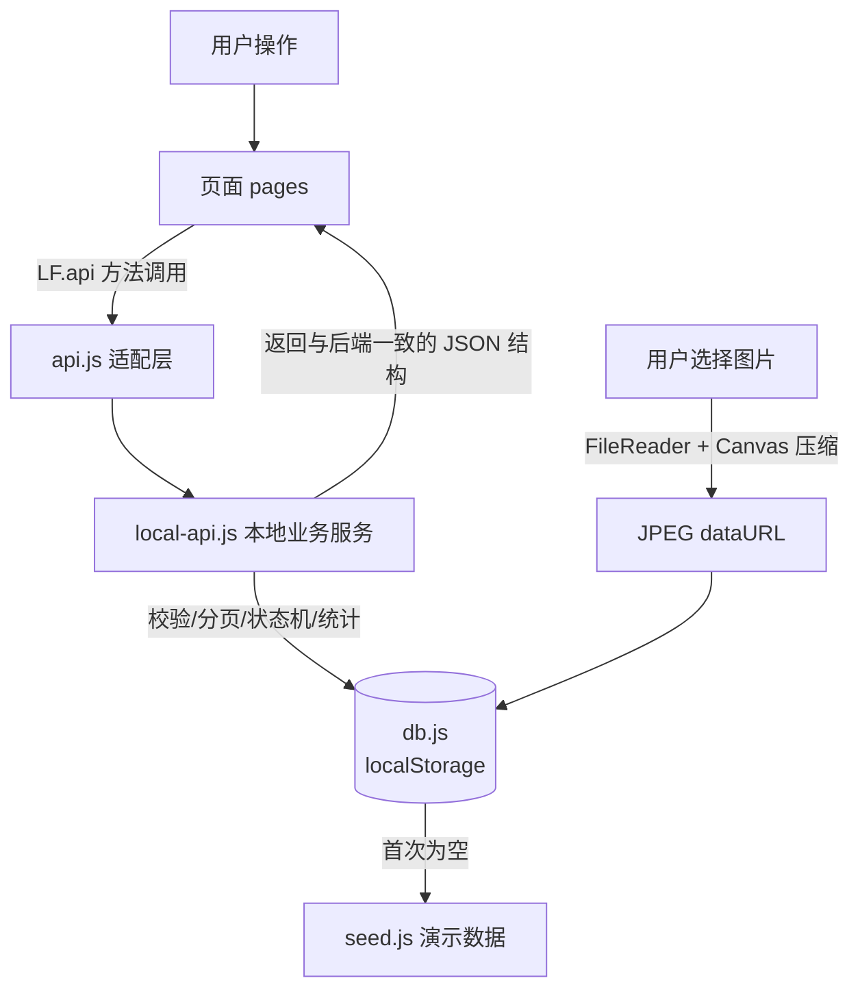
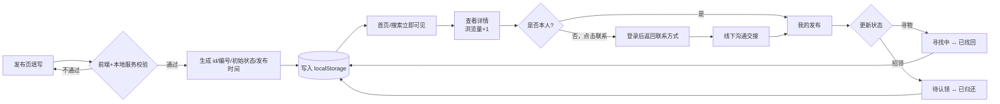
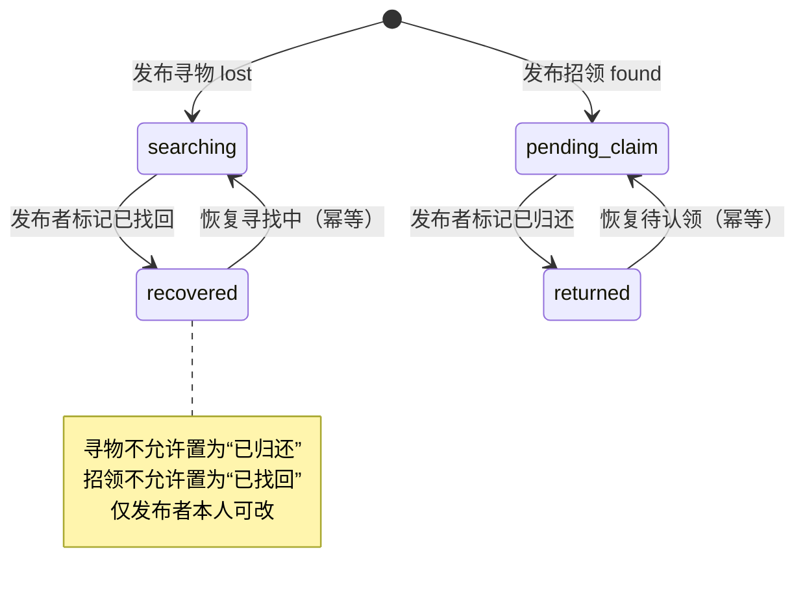

# 软件工程第二次结对作业

| 项目                 | 内容                                                         |
| -------------------- | ------------------------------------------------------------ |
| 这个作业属于哪个课程 | [首页 - H202601软件工程与软件工程实践 - 福州大学 - 班级博客 - 博客园](https://edu.cnblogs.com/campus/fzu/2026-01SoftwareEngineeringandSoftwareEngineeringPractice?filter=homework) |
| 这个作业要求在哪里   | [2026秋软件工程结对作业（第二次之程序实现）- H202601软件工程与软件工程实践 - 班级博客 - 博客园](https://edu.cnblogs.com/campus/fzu/2026-01SoftwareEngineeringandSoftwareEngineeringPractice/homework/16745) |
| 这个作业的目标       | 实现"校园失物招领"核心功能，并同时交付 **Web 端**与 **Android App（APK）** 两种呈现形式 |
| 姓名                 |                                                              |
| 学号                 |                                                              |
| 合作伙伴             |                                                              |
| GitHub 仓库          | https://github.com/Clu3y/102401632-102401633                 |
| APK 下载（v1.0.0）   | https://github.com/Clu3y/102401632-102401633/releases/download/v1.0.0/app.apk |

---

## 一、具体分工

| 成员 | 主要分工 |
| --- | --- |
| 【姓名 A】 | 原型走查与需求梳理；本地数据层（`seed.js` / `db.js`）；列表、搜索、详情页；单元测试用例设计与测试框架搭建；**Web 端响应式改造（桌面/平板/手机布局）、登录注册与会话门禁**；博客撰写 |
| 【姓名 B】 | 发布、发布成功、我的发布、个人资料页；状态流转与权限校验；图片本地压缩；样式与交互联调；回归测试与 README；**Android WebView 壳工程与 APK 打包、真机安装验证；项目结构整理** |

两人采用**结对编程 + 模块认领**结合：数据结构、接口契约、状态机、双端目录约定等核心设计一起讨论确定（驾驶员/领航员轮换），各自负责的页面与端再分头实现，最后交叉走查、合并、补测试。

---

## 二、项目展示

项目同时交付两种呈现形式，二者共用同一套本地数据层与业务规则：

- **Web 端（`web/`）**：桌面 / 平板 / 手机自适应，Chrome 直接运行；
- **Android App 端（`mobile/`，安装包 `mobile/apk/app.apk`）**：由最初的手机形态页面经 WebView 壳打包，真机离线可运行。

### 2.1 Web 端

<p align="center">
   &nbsp;
   &nbsp;
  
</p>
<p align="center">
   &nbsp;
   &nbsp;
  
</p>

<div align="center">
<sub>首页（桌面侧边导航）　·　搜索　·　发布　·　登录 / 注册　·　发布成功　·　我的发布</sub>
</div>

### 2.2 Android App 端（真机截图）

<p align="center">
   &nbsp;
   &nbsp;
   &nbsp;
  
</p>
<p align="center">
   &nbsp;
   &nbsp;
   &nbsp;
  
</p>

<div align="center">
<sub>首页　·　搜索结果　·　详情与相关推荐　·　发布　·　发布成功回执　·　我的发布　·　联系发布者　·　空结果引导</sub>
</div>

## 三、PSP 表格

第一阶段（手机形态核心功能，即 `mobile/` 的原型实现）PSP：

| PSP2.1 | 阶段 | 预估耗时 | 实际耗时 |
| --- | --- | ---: | ---: |
| Planning | 计划 | 20 | 25 |
| Estimate | 估计任务所需时间 | 20 | 20 |
| Analysis | 需求分析（含学习新技术） | 90 | 110 |
| Design Spec | 生成设计文档 | 60 | 70 |
| Design Review | 设计复审 | 30 | 35 |
| Coding Standard | 制定代码规范 | 25 | 20 |
| Design | 具体设计（数据结构/接口契约/状态机） | 90 | 120 |
| Coding | 具体编码 | 300 | 360 |
| Code Review | 代码复审 | 60 | 80 |
| Test | 测试（自测、改代码、提交） | 120 | 180 |
| Test Report | 测试报告 | 40 | 50 |
| Size Measurement | 计算工作量 | 20 | 20 |
| Postmortem & Process Improvement Plan | 事后总结与改进计划 | 30 | 40 |
| **合计** |  | **925** | **1130** |

**偏差分析**：实际比预估多约 220 分钟，主要超在三处——① 具体设计阶段，为了让"前端也能完整跑通后端逻辑"，重新设计了本地数据层与接口契约；② 编码阶段处理图片本地压缩、状态机边界等比预想细；③ 测试阶段搭建可在 Node 中加载浏览器脚本的测试环境（vm 沙箱）以及排查跨 realm 断言问题明显超时。

第二阶段（响应式 Web 端增强 + Android APK 打包 + 双端结构整理）补充 PSP（**分钟数请按实际情况补填**）：

| PSP2.1 | 阶段 | 预估耗时 | 实际耗时 |
| --- | --- | ---: | ---: |
| Analysis | 响应式改造点与 APK 打包方案调研 |  |  |
| Design | 双端目录约定、Web 端会话/门禁设计 |  |  |
| Coding | Web 端响应式布局、登录注册与会话、素材配图 |  |  |
| Coding | Android WebView 壳工程、APK 打包 |  |  |
| Test | Web 端补充用例、真机安装与双端回归 |  |  |
| Reporting | 双端 README、目录与博客整理 |  |  |
| **合计** |  |  |  |

---

## 四、解题思路与设计实现

### 4.1 代码实现思路

题目要求实现"**发布信息 → 浏览或搜索 → 查看详情 → 联系发布者 → 更新状态**"的闭环。我们沿用第一次作业的原型，做成一个移动端风格的 Web 单页应用（hash 路由），页面包括：首页、搜索、发布、详情、发布成功、我的发布。

考虑到评分要求"**其他同学下载所有文件后，用 Chrome 运行 html 就能看到预期结果**"（APP 则要"保证 apk 能展现预期效果"），如果依赖 Spring Boot + MySQL，测试同学还要装 JDK、初始化数据库、启动后端、处理端口和跨域，复现门槛高、容易翻车。因此我们做了一个工程上的取舍：

- **页面、样式、交互、以及对后端接口的调用方式完全按真实前后端分离项目来写**（统一的 `LF.api`、Promise、统一返回结构、camelCase、分页结构、状态码语义）；
- 但把"后端"以一个**浏览器内本地数据层**的形式实现：两端目录下的 `js/data/local-api.js` 承载全部业务规则，`js/data/db.js` 用 `localStorage` 持久化，`js/data/seed.js` 提供开箱即用的 14 条演示数据；
- 页面只依赖 `LF.api` 的方法签名与返回结构，**不感知数据来自网络还是本地**。将来接回真实后端时，只需把 `js/utils/api.js` 的转发目标从 `localApi` 换回 HTTP 请求，页面零改动。

**双端演进**：先用 Web 页面模拟手机 App（`mobile/`，桌面浏览器里是居中的手机外壳）；随后用一个极薄的原生 Android WebView 壳工程把 `mobile/` 的前端源码原样打包成可安装、离线可运行的 APK（产物 `mobile/apk/app.apk`）；最后又在同一套数据层与业务规则之上，完善出桌面 / 平板 / 手机自适应的响应式 Web 端（`web/`），并补充了独立登录注册页、会话管理与更丰富的素材。两端业务核心同构，差异集中在视图层与外壳。

整体分层如下（两端一致，仅根目录前缀不同）：

```
页面 pages/*.js（首页/搜索/发布/详情/我的发布）
        │  只调用 LF.api.xxx()，返回 Promise
        ▼
js/utils/api.js（接口集合，适配层）
        │  当前转发给本地实现；接后端时转发给 fetch
        ▼
js/data/local-api.js（业务规则：校验/状态机/分页/搜索/统计/联系方式）
        ▼
js/data/db.js（localStorage 数据库：主键、编号、持久化）
        ▼
js/data/seed.js（首次打开写入的 14 条演示数据）
```

### 4.2 流程图

**（1）总体数据流（分层与依赖）**



**（2）核心业务流程：发布 → 浏览/搜索 → 详情 → 联系 → 更新状态**



**（3）信息状态机（状态迁移测试的依据）**



### 4.3 重要代码片段

**① 适配层：页面不感知数据来源（两端 `js/utils/api.js`）**

```js
(function (LF) {
  var api = LF.localApi;
  // 本地数据服务的方法签名与原后端接口一一对应，直接转发即可。
  LF.api = {
    login: api.login,
    getItems: api.getItems,
    searchItems: api.searchItems,
    getItemDetail: api.getItemDetail,
    getItemContact: api.getItemContact,
    createItem: api.createItem,
    updateItemStatus: api.updateItemStatus,
    getMyItems: api.getMyItems,
    getCurrentUser: api.getCurrentUser,
    updateCurrentUser: api.updateCurrentUser,
    uploadImage: api.uploadImage
  };
})(window.LF);
```

意义：页面代码与真实前后端分离项目完全一致，本地实现、HTTP 后端、WebView 壳三种宿主可平滑替换，符合"面向接口编程"。

**② 状态机 + 所有权校验（`js/data/local-api.js`，对应接口 PATCH `/items/{id}/status`）**

```js
var ALLOWED_STATUS = {
  lost: ['searching', 'recovered'],
  found: ['pending_claim', 'returned']
};
function updateItemStatus(id, status) {
  return delay(function () {
    var me = requireUser();                 // 必须登录
    var item = findItem(id);
    if (!item) throw new Error('信息不存在或已被删除');
    if (item.publisherId !== me.id) throw new Error('只能操作本人发布的信息'); // 越权拦截
    if (ALLOWED_STATUS[item.type].indexOf(status) === -1) {
      throw new Error('非法的状态变更，请刷新后重试');   // 跨类型状态拦截
    }
    item.status = status;                   // 幂等：重复设置同一状态也成功
    LF.db.save();
    return { id: item.id, status: item.status,
             statusText: STATUS_TEXT[item.status], updatedAt: LF.db.formatTs(new Date()) };
  });
}
```

**③ 搜索：关键词同时匹配名称、地点、描述、编号（对应 GET `/items/search`）**

```js
var keyword = (params.keyword || '').trim().toLowerCase();   // 先 trim
var list = currentState().items.filter(function (it) {
  if (params.type && params.type !== 'all' && it.type !== params.type) return false;
  if (!keyword) return true;                                  // 空关键词 = 全部
  var hay = [it.name, it.location, it.description || '', it.itemNo].join(' ').toLowerCase();
  return hay.indexOf(keyword) > -1;
});
```

**④ 信息编号生成（`js/data/db.js`）：寻物 `L+yyyyMMdd+序号`，招领 `F` 前缀，按天计数**

```js
function nextItemNo(st, type, date) {
  var prefix = type === 'lost' ? 'L' : 'F';
  var key = prefix + ymd(date);
  st.itemNoSeq[key] = (st.itemNoSeq[key] || 0) + 1;
  return key + pad2(st.itemNoSeq[key]);   // 例如 L2026100201
}
```

**⑤ 图片不上传服务器：本地读取 + Canvas 压缩为 dataURL（`local-api.js`）**

```js
function fileToDataUrl(file, maxEdge, quality) {
  return new Promise(function (resolve, reject) {
    var reader = new FileReader();
    reader.onload = function () {
      var img = new Image();
      img.onload = function () {
        /* 等比缩放到最长边 900，铺白底后转 JPEG，避免 localStorage 被大图撑爆 */
        var w = img.width, h = img.height;
        if (w > h && w > maxEdge) { h = Math.round(h * maxEdge / w); w = maxEdge; }
        else if (h >= w && h > maxEdge) { w = Math.round(w * maxEdge / h); h = maxEdge; }
        var canvas = document.createElement('canvas');
        canvas.width = w; canvas.height = h;
        var ctx = canvas.getContext('2d');
        ctx.fillStyle = '#ffffff'; ctx.fillRect(0, 0, w, h);
        ctx.drawImage(img, 0, 0, w, h);
        resolve(canvas.toDataURL('image/jpeg', quality));
      };
      img.src = reader.result;
    };
    reader.readAsDataURL(file);
  });
}
```

### 4.4 Android App：把零后端网页装进 APK

App 端没有再写一套原生业务，而是用一个**极薄的原生 WebView 壳**承载同一份前端代码：

- 壳工程只有一个全屏 `MainActivity`，其中的 `WebView` 直接加载打包在内的本地资源 `file:///android_asset/www/index.html`，并开启 `domStorageEnabled`（localStorage 依赖它）；
- 构建时把 `mobile/` 下的 `index.html`、`assets/`、`css/`、`js/` 复制到壳工程的 `app/src/main/assets/www/`（不复制 `apk/`、`server.js`、`单元测试/`），再用 Gradle 构建出 APK；
- 成品信息：应用名「校园失物招领」，包名 `com.example.lostfound`，版本 1.0，由 Android Gradle Plugin 8.7.2 构建；
- 因为页面与数据都在本机（localStorage），**App 安装后离线即可运行**，不依赖任何服务器；
- 安装包已发布到 GitHub Release（tag `v1.0.0`，约 97 KB）：测试同学在安卓手机上打开 [app.apk 下载链接](https://github.com/Clu3y/102401632-102401633/releases/download/v1.0.0/app.apk)即可下载安装，无需克隆仓库。

为避免"打进包里的文件和仓库源码不一致"，我们对 APK 内 `assets/www/` 与 `mobile/` 源码做了**逐文件哈希比对，结果完全一致**，做到"所见即所装"；Release 安装包的 SHA-256 为 `3D862E039ABA6367D5154E36D3FFAA53C466DF0F1B960DE39F0F129E36886F1E`，可供下载后核对。

### 4.5 Web 端增强

在同一套数据层之上，Web 端（`web/`）面向桌面浏览做了增强：

- **响应式布局**：`responsive.css` / `media.css` 按断点在桌面侧边导航、平板品牌栏、手机单栏 + 底部 Tab 之间切换；
- **完整账号体系**：新增 `data/accounts.js` 与 `pages/auth.js` 独立登录 / 注册页，发布与"我的发布"作为受保护路由，未登录时先给占位页、再弹原地登录窗，登录成功回到原目标页；定时 / 窗口聚焦时检查会话，过期清理私人内容；
- **体验细节**：发布草稿保留、无障碍"跳到页面内容"链接、lucide 图标、实物配图与插画。

---

## 五、附加特点设计

| # | 特点 | 设计意义 | 实现方式 |
| --- | --- | --- | --- |
| 1 | **零后端、零安装、双击即跑** | 测试同学无需 JDK/MySQL/改配置，彻底消除环境差异导致的复现失败 | 浏览器内本地数据层 + localStorage，接口契约与真实后端一致，可平滑切回 |
| 2 | **一套核心、双端交付（Web + 离线 APK）** | 同一题目两种呈现形式都能验收：Chrome 打开是网页，装到手机是 App，且业务行为一致 | `web/` 响应式网页；`mobile/` 经原生 WebView 壳打包为 `apk/app.apk`，共用 `LF.api` 与本地数据层 |
| 3 | **图片本地压缩** | 不上传服务器也能发图，且避免大图撑爆浏览器 / WebView 存储 | FileReader + Canvas 等比缩放至 900px、转 JPEG dataURL |
| 4 | **联系方式一键复制 / 拨打、且按需可见** | 隐私保护：列表与详情都不暴露联系方式，主动点击"联系发布者"才拉取；微信一键复制、手机一键 `tel:` 拨号 | `getItemContact` 独立接口 + Clipboard API（含降级方案） |
| 5 | **证件类隐私提示 + 敏感信息不直接展示** | 呼应原型隐私设计，降低学号/卡号泄露风险 | 详情页对 `id_card` 类别显示专门隐私提示，种子数据对卡号做了脱敏 |
| 6 | **演示数据一键重置 + 相对时间** | 任何时候打开都有完整可演示数据；"刚刚/x 分钟前"随时间自然 | seed 时间用"距当前分钟数"动态生成；提供 `LF.localApi.resetDemo()` |
| 7 | **完整的表单 / 状态校验与空结果引导** | 不只走"顺利路径"：必填、未来时间、图片超限、无搜索结果、越权、非法状态都有提示 | 本地服务端二次校验 + 前端引导（推荐搜索、去发布） |
| 8 | **Web 端登录注册与会话门禁（响应式）** | 桌面端账号体验完整，受保护操作不丢失原目标页，会话过期有清理 | 独立 auth 页 + 路由门禁 + 原地登录弹窗 + 会话定时检查 + 草稿恢复 |

---

## 六、目录说明与使用说明

### 6.1 项目结构

```
lost-found/
├─ README.md                  # 双端总说明（目录与运行方式以它为准）
├─ LICENSE                    # MIT
├─ docs/
│  └─ screenshots/
│     ├─ web/                 # Web 端展示截图
│     └─ mobile/              # App 真机截图
├─ web/                       # ===== Web 端（响应式）=====
│  ├─ index.html              # 单页应用入口
│  ├─ server.js               # 零依赖静态服务器（可选，默认 8090）
│  ├─ README.md / LICENSE
│  ├─ assets/                 # tabbar 图标、分类图、lucide 图标、实物配图与插画
│  ├─ css/                    # global + 页面样式 + responsive/media/auth
│  ├─ js/
│  │  ├─ config.js / app.js   # 配置 / hash 路由与启动
│  │  ├─ data/                # seed 演示数据 / db(localStorage) / accounts 账号 / local-api
│  │  ├─ utils/               # api 适配层、auth、ui、icons、media、draft、query、format
│  │  ├─ components/tabbar.js # 底部导航
│  │  └─ pages/               # auth 登录注册 / home / search / publish / detail / success / my-posts
│  ├─ docs/                   # 开发与验证过程记录、回归截图（过程材料）
│  └─ 单元测试/                # 7 个测试文件
└─ mobile/                    # ===== Android App 端（手机形态）=====
   ├─ index.html              # 入口（桌面浏览器含手机状态栏外壳）
   ├─ server.js               # 浏览器预览用静态服务器（建议 8091）
   ├─ README.md / LICENSE
   ├─ apk/
   │  └─ app.apk              # ★ Android 安装包（WebView 壳 + assets/www）
   ├─ assets/                 # tabbar 图标、6 类分类图
   ├─ css/                    # global（含手机外壳）+ 页面样式
   ├─ js/
   │  ├─ config.js / app.js   # 配置 / 路由与启动（首启匿名静默登录）
   │  ├─ data/                # seed / db(localStorage) / local-api
   │  ├─ utils/               # api 适配层、auth、ui、format、url
   │  ├─ components/tabbar.js
   │  └─ pages/               # home / search / publish / detail / success / my-posts
   └─ 单元测试/                # 3 个测试文件
```

### 6.2 如何运行

**Web 端（统一用 Google Chrome）：**

1. 直接用 Chrome 打开 `web/index.html`；
2. 或在 `web` 目录执行 `node server.js`，浏览器访问 `http://localhost:8090`。

**App 端（二选一）：**

1. **真机安装（作业 APP 交付物）**：在安卓手机上点击下载安装包 [app.apk（v1.0.0）](https://github.com/Clu3y/102401632-102401633/releases/download/v1.0.0/app.apk)，允许"安装未知来源应用"后安装，桌面出现「校园失物招领」图标，离线即可运行（仓库内 `mobile/apk/app.apk` 为同一份安装包）；
2. **电脑浏览器预览手机界面**：在 `mobile` 目录执行 `node server.js 8091`（用 8091 避免与 Web 端 8090 冲突），访问 `http://localhost:8091`，或直接双击 `mobile/index.html`。

---

## 七、单元测试

### 7.1 测试工具选型、学习过程与简易教程

**选型**：作业附录推荐了 Mocha。我们学习并对比了常见 JS 测试方案（Mocha、Jest、Node 内置 test runner）后，选择 **Node.js 内置测试运行器 `node:test` + 内置断言 `node:assert/strict`**，理由：

- **零第三方依赖、零安装**：Node ≥ 18 自带，`npm test` 一定能跑起来，不会因为网络装不上 Mocha/Jest 而让测试"在我电脑上能跑"；
- **天然自动化**：一条命令递归运行、退出码反映成败，可放进每日构建；
- **语法与 Mocha 一致**（`describe / it / beforeEach`，BDD 风格），我们从 Mocha 教程学到的用例组织、钩子、断言思想完全通用；将来迁移到 Mocha 只需改导入方式。

**学习路径**：先读《测试框架 Mocha 实例教程》理解断言、测试套件、钩子、异步测试、用例隔离；再查 Node 官方文档 `node:test`，确认其 describe/it/beforeEach 与 assert 用法；先用一个小例子跑通，再迁移到本项目。

**一份你自己的简易教程：**

1. **环境**：安装 Node 18+（命令行 `node -v` 能看到版本即可），测试框架不用 `npm install`。
2. **写测试**：新建 `tests/xxx.test.js`，文件名以 `.test.js` 结尾，Node 会识别为测试文件：

   ```js
   const { describe, it, beforeEach } = require('node:test');
   const assert = require('node:assert/strict');

   describe('被测模块', () => {
     it('应当满足某性质', () => {
       assert.equal(1 + 1, 2);           // 同步断言
     });
     it('异步接口用 await', async () => {
       const data = await someAsync();
       assert.ok(Array.isArray(data.records));
     });
   });
   ```

3. **跑测试**：`node --test tests/a.test.js tests/b.test.js`，或在 `package.json` 配
   `"scripts": { "test": "node --test tests/*.test.js" }` 后执行 `npm test`。
4. **看结果**：`# pass / # fail` 汇总，失败会给出期望值/实际值与代码位置；进程退出码非 0 表示有失败，可被 CI/每日构建识别。
5. **用例隔离**：每个用例在 `beforeEach` 里构造全新的内存数据库，互不污染、可重复运行。

### 7.2 单元测试代码展示与被测函数说明

两端各自带一套自动化测试，**全部通过**：

| 端 | 位置 | 测试文件数 | 用例数 | 结果 |
| --- | --- | ---: | ---: | --- |
| App 端（手机形态） | `mobile/单元测试/tests/` | 3 | **58** | `# pass 58 / # fail 0` |
| Web 端（响应式） | `web/单元测试/tests/` | 7 | **100** | `# pass 100 / # fail 0` |

运行命令：

```bash
cd mobile/单元测试 && npm test   # App 端：local-api / db / utils
cd web/单元测试    && npm test   # Web 端：另含 accounts / auth-navigation / media / responsive-features
```

被测函数与对应文件：

| 测试文件 | 被测对象 | 覆盖的函数/接口 |
| --- | --- | --- |
| `local-api.test.js`（两端都有） | 本地业务服务 | `login`、`getItems`、`searchItems`、`getItemDetail`、`getItemContact`、`createItem`、`updateItemStatus`、`getMyItems`、`getCurrentUser`、`updateCurrentUser`、`uploadImage` |
| `db.test.js`（两端都有） | 数据库工具 | `detectContactType`、`formatTs`、`nextItemNo`、`save/load/resetDemo` |
| `utils.test.js`（两端都有） | 纯工具 | `format.parseDate/formatDateTime*/formatRelative`、`urlUtil.resolveImageUrl(s)` |
| `accounts.test.js`（仅 Web） | 账号库 | 注册 / 登录 / 登出、重复账号与错误口令 |
| `auth-navigation.test.js`（仅 Web） | 鉴权与导航门禁 | 未登录拦截、登录后回到目标页、会话过期 |
| `media.test.js`（仅 Web） | 图片前置校验 | 图片类型 / 数量 / 大小限制 |
| `responsive-features.test.js`（仅 Web） | Web 增强逻辑 | 响应式相关纯逻辑与工具 |

**示例 1：状态迁移 + 权限（白盒）**

```js
it('发布者可把寻物标记为已找回，文案正确并带更新时间', async () => {
  const created = await LF.api.createItem(validPayload(LF));
  const res = await LF.api.updateItemStatus(created.id, 'recovered');
  assert.equal(res.status, 'recovered');
  assert.equal(res.statusText, '已找回');
  assert.ok(res.updatedAt);
});
it('权限：不能修改他人发布的信息', async () => {
  await assert.rejects(LF.api.updateItemStatus(2, 'returned'), /本人|权限/);
});
it('非法状态迁移：寻物不能置为“已归还”', async () => {
  const lost = await LF.api.createItem(validPayload(LF, { type: 'lost' }));
  await assert.rejects(LF.api.updateItemStatus(lost.id, 'returned'), /状态/);
});
```

**示例 2：分页边界值（pageSize 钳制 1~20、非法页码归一）**

```js
it('pageSize 超过 20 被钳制为 20，非法页码归一到第 1 页', async () => {
  const big = await LF.api.getItems({ page: 1, pageSize: 999 });
  assert.equal(big.pageSize, 20);
  assert.equal(big.records.length, 14);
  const zero = await LF.api.getItems({ page: 0, pageSize: 0 });
  assert.equal(zero.page, 1);
  assert.equal(zero.pageSize, 10);
});
```

**示例 3：测试环境垫片（让浏览器脚本跑在 Node 里）**

```js
const sandbox = { console, Date, Math, JSON, Promise, localStorage: memoryStorage() };
sandbox.setTimeout = (fn) => { fn(); return 0; }; // 去掉模拟网络延时，保留 Promise 语义
sandbox.window = sandbox;
vm.createContext(sandbox);
FILES.forEach(f => vm.runInContext(fs.readFileSync(path.join(JS_ROOT, f),'utf8'), sandbox));
return { LF: sandbox.LF };
```

实际执行输出：

```
# App 端（mobile/单元测试）
# tests 58
# pass 58
# fail 0

# Web 端（web/单元测试）
# tests 100
# pass 100
# fail 0
```

### 7.3 测试数据构造思路，以及如何应对"刁难"

我们以**白盒设计方法**为主来构造用例，先读代码理清分支与边界，再逐条覆盖：

- **等价类划分**：类型（失物/招领）、登录态（本人/他人/匿名）、联系方式（微信/手机号）、搜索（命中名称/地点/描述/无命中）。
- **边界值分析**：分页 `pageSize` 取 0、1、10、20、999；图片恰好/超过 3 张与 5MB；发生时间卡在"现在 +5 分钟"附近；编号同一天跨第 1、2 条；文本长度上下限。
- **状态迁移测试**：沿状态机四条合法迁移各测一次，再故意走两条非法跨类型迁移；并验证重复设置同一状态的**幂等性**。
- **权限/安全测试**：匿名拉联系方式、非发布者改状态都必须被拒绝；详情接口断言**不返回 `contactValue`**。
- **错误推测（主动刁难自己）**：关键词首尾空格、空关键词、搜不到结果、不存在的 id、漏填每一个必填项、不勾协议、未来时间、非法类别枚举、非法图片类型、刷新后数据是否还在。
- **Web 端补充**：重复注册 / 错误口令、未登录访问受保护页被拦截且登录后回到原目标页、会话过期清理、图片类型与大小前置校验。

**数据策略**：固定 14 条**种子数据**刻意覆盖 6 个类别、2 种类型、4 种状态（含已结束）和有无图片两种情况，保证列表/筛选/统计/推荐都有确定性结果；动态新增的数据则用 `validPayload()` 工厂函数生成、按需覆盖字段。每个用例在 `beforeEach` 中拿到**全新的内存数据库**，互不干扰、可反复运行，不依赖真实浏览器数据。

**自我评价**：核心业务规则（发布校验、状态机、权限、分页搜索、统计、联系方式、持久化）已被正常/边界/异常三类用例覆盖，能满足本程序的回归需要；图片上传的"压缩成功路径"依赖浏览器 Canvas/DOM（App 端为 WebView 环境），Node 中不便断言，目前覆盖了其类型与大小的前置校验分支，成功路径通过 Chrome 手工走查与真机安装走查补充，这是当前测试的边界。

---

## 八、GitHub 签入记录


---

## 九、遇到的异常 / 结对困难与解决

**问题 1：没有后端时如何模拟一个"后端"，又不让页面写死？**
- 尝试：最初想让页面直接读写 localStorage，很快发现业务规则（校验、状态机、统计）会散落在各页面，难以测试也无法对接真实后端。
- 解决：抽出 `local-api.js` 作为唯一业务出口，页面只依赖 `LF.api` 的契约；`api.js` 做适配层转发。
- 收获：体会到"面向接口/分层"的价值——同一套页面既能接本地实现也能接 HTTP 后端，业务规则集中后单元测试非常好写。

**问题 2：图片在没有服务器/对象存储时怎么保存？**
- 尝试：直接存 base64 原图，几张手机照片就把 localStorage（约 5MB）撑爆，写入抛异常。
- 解决：FileReader 读入后用 Canvas 等比压缩到最长边 900px、铺白底转 JPEG dataURL，并对存储写入做 try/catch，给出"空间不足请减少图片"的友好提示。
- 收获：前端能力边界（存储配额）要在设计时就考虑，异常路径要给用户可理解的反馈。

**问题 3：单元测试在 Node 里加载不了浏览器脚本。**
- 尝试：直接 `require` 前端文件会报 `window/localStorage is not defined`；引入 jsdom 又要联网安装、违背"零依赖可跑"。
- 解决：用 Node 内置 `vm` 造隔离全局，提供内存版 `localStorage`，按 `index.html` 顺序加载脚本。
- 收获：分清"依赖 DOM 的视图层"和"不依赖 DOM 的业务层"，把业务逻辑写成可在任意宿主运行的纯逻辑，是可测试性的关键。

**问题 4：测试断言报"结构相同但引用不等"。**
- 尝试：`deepStrictEqual` 比较 vm 沙箱里产生的数组/对象与测试里的字面量，值一样却失败。
- 定位：vm 是独立的 JS realm，沙箱内对象的原型（`Array.prototype`/`Object.prototype`）与测试主上下文不同，严格深比较会校验原型。
- 解决：对跨 realm 的复合值，用 `Array.from(...)` 转回主上下文数组、或逐字段 `assert.equal` 比较，而非整体 `deepStrictEqual`。
- 收获：理解了 JS realm 与原型身份，断言失败时要读 expected/actual 与 operator，而不是怀疑业务逻辑。

**问题 5：没有后端的网页，怎么装进 APK 并保证离线可用？**
- 担心：WebView 直接加载远程 URL 仍需要一台服务器，违背"零后端"；`file://`/本地资源下 hash 路由、localStorage、Canvas 压缩是否可用也要验证。
- 解决：写一个只有全屏 WebView 的原生壳，加载打包在内的 `file:///android_asset/www/index.html`，并显式开启 DOM storage；纯前端零依赖代码天然离线运行。打包后把 APK 内 `assets/www/` 解出与 `mobile/` 源码**逐文件哈希比对，全部一致**，再装到真机走查发布→搜索→联系→改状态的完整闭环。
- 收获：WebView 本质是浏览器内核，纯前端应用几乎可以零改造复用；发布二进制产物时要做"产物与源码一致性"校验，避免装出去的包和仓库代码不是同一份。

**问题 6：手机形态页面演进为桌面响应式后，"需要登录"的操作如何不打断流程？**
- 尝试：桌面端若直接跳登录页，用户在发布页填到一半的内容、原来想去的目标页都会丢失。
- 解决：把发布与"我的发布"设为受保护路由，未登录时先显示占位页并弹出原地登录窗，登录成功回到原目标 hash；发布内容做草稿保留；会话过期时清理私人内容并提示重新登录。
- 收获：门禁要和导航、草稿、会话状态一起设计，"拦住未登录用户"和"不破坏用户正在做的事"同样重要。

---

## 十、评价队友

- **值得学习的地方**：
- **需要改进的地方**：

---

## 十一、小结


