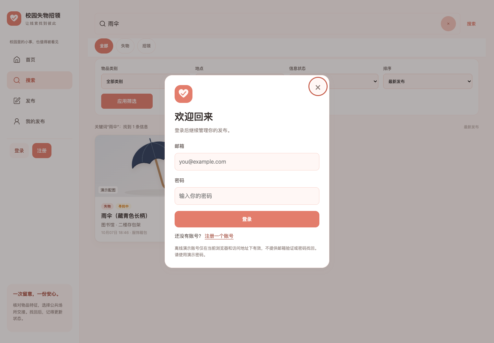
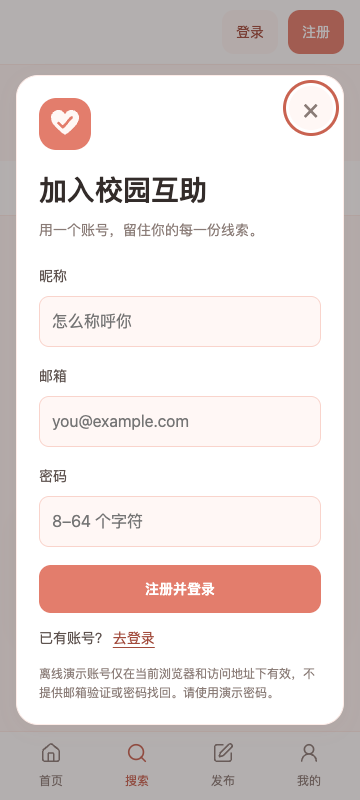
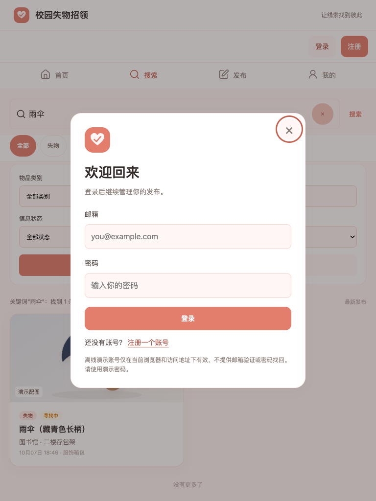

# 原地登录弹窗验证

日期：2026-10-07。仅修改 `lost-found`；账号存储格式、发布规则、Java 后端和原型材料保持原有范围，未提交或推送。

## 当前交互

| 入口 | 未登录时 | 成功后 |
| --- | --- | --- |
| 发布／我的发布导航 | 当前页面弹窗，地址和导航选中状态保持 | 进入目标地址，保留寻物／招领参数 |
| 详情的联系发布者 | 详情页弹窗 | 自动打开该物品联系方式 |
| 桌面、平板、手机账号栏 | 当前页面登录／注册弹窗 | 更新昵称及退出按钮，留在原页 |
| 直接打开受限地址 | 对应页面需要登录占位，导航选中目标，打开弹窗 | 挂载对应业务页面 |
| 主动退出 | 清除私人视图与浮层，受限页面显示占位 | 由用户点击重新登录 |
| 会话过期 | 先隐藏私人内容，再原地弹窗 | 继续已保存的目标或回调 |

关闭按钮、点击遮罩和 Esc 均取消操作，恢复触发控件的焦点。登录与注册在同一弹窗切换，保留邮箱、清除密码，首次注册保留旧数据绑定确认。弹窗同时只允许一个实例；背景使用浏览器的 `inert` 属性禁止点击及键盘聚焦，沿用现有 Tab 焦点约束。弹窗可滚动，入场过渡为 160ms，减少动态效果设置下关闭动画。

`js/pages/auth.js` 维护共用表单及弹窗生命周期；`#/auth` 独立页复用该表单。`LF.auth.requestLogin(next, { mode, onSuccess })` 接收目标地址或成功回调，无目标时进入我的发布。账号栏传入只更新展示的回调；联系方式回调保留详情节点，避免再次增加浏览次数或重置滚动。关闭、切换模式及页面销毁时取消未完成的密码校验，防止迟到响应恢复身份或导航。

程序导航与普通导航链接在地址改变前拦截。浏览器历史和外部 hash 变化保留门禁；冷启动受限地址显示占位。中文参数先按浏览器编码规范统一，再判断是否为重复导航。到期事件保留已有弹窗中的操作目标，避免用户刚点击的导航或联系方式回调丢失。

账号与文字草稿继续按用户隔离；有草稿时草稿类型优先于首页预选，这是既有发布规则。离线账号、权限和存储边界见 [离线登录与验证](离线登录与验证.md)。

## 实际验证

- Node 内置测试：100 项通过，18 个套件，0 失败。含原账号规范化、密码、绑定、隔离、存储失败回滚、业务权限与草稿回归，新增目标参数、弹窗续接接口及退出／过期事件区分检查。
- Chrome 独立上下文：检查首页、带关键词的搜索和详情原地弹窗；逐项比对 DOM 节点、地址、滚动、搜索输入与导航选中状态。验证三种关闭方式、焦点恢复、背景禁用、模式切换、错误提示、重复提交、单实例、直接受限地址占位、浏览器后退、退出和到期处理。
- 验证发布／我的发布续接、联系方式自动打开、账号栏原地更新；密码派生延迟时关闭弹窗或切换页面均不恢复身份、不导航。点击受限操作时恰好到期仍保留目标及回调。
- 登录／注册弹窗覆盖 360×800、393×852、768×1024、1024×768、1440×1000，共 10 个布局场景；检查横向溢出、输入边界、弹窗垂直边界及减少动态效果设置。
- 断网 `file://` 直接打开 HTML：注册、登录、退出、刷新和发布拦截。既有业务回归另覆盖 36 个布局场景，配图回归覆盖 30 个布局场景及图片失败降级。

最终浏览器结果以以下独立报告为准：

- [交互与布局报告](弹窗20261007-07-浏览器验证.json)
- [配图回归报告](弹窗20261007-07-配图验证.json)
- 业务回归日志 `弹窗20261007-07-browser-check.log`、配图日志 `弹窗20261007-07-media-browser-check.log` 和单元测试日志 `弹窗20261007-06-单元测试.log` 仅在本机保留，不随仓库上传。当前验证摘要见 [提交前审查与验证](提交前审查与验证.md)，不将这些历史日志当作本次重新运行的结果。

前序 `弹窗20261007-01` 至 `04` 是发现问题时保留的中途截图，不作为通过依据；`05`、`06` 属于修正和补充用例前的阶段验收。所有本轮图片、JSON 和日志使用独立前缀，没有覆盖旧登录验收或原型资料。临时 Chrome 和静态服务在脚本结束时关闭。

**未运行**真实手机及软键盘、Safari、Firefox、跨设备与生产环境验证。手机和平板结果来自 Chrome 模拟视口；离线权限不能替代服务器认证。

## 复现

从 `lost-found` 执行：

```bash
node --test 单元测试/tests/*.test.js
# 也可进入单元测试目录运行 npm test，二者使用相同测试入口。

# 需已有 Chrome 与 Playwright；默认按时间戳生成新的输出前缀。
node 单元测试/auth-browser-check.cjs
```

Playwright 不在默认路径时设置 `LF_PLAYWRIGHT_PATH`。可设置新的 `LF_AUTH_RUN_ID` 指定截图、报告及嵌套回归日志的统一前缀。脚本只启动本机随机端口静态服务，使用独立浏览器上下文，不读取或清理个人 Chrome 数据。本次使用已有 Node 和 Playwright，没有安装依赖；运行环境未提供 npm，所以实际通过上述等价 Node 命令运行单元测试。



<p>
  
  
</p>
