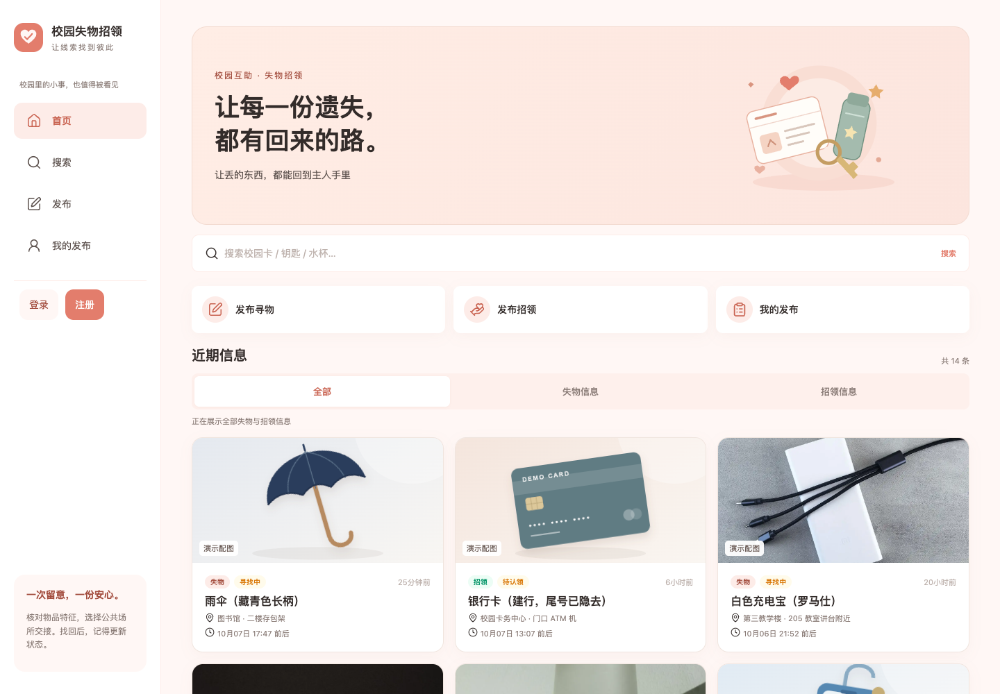
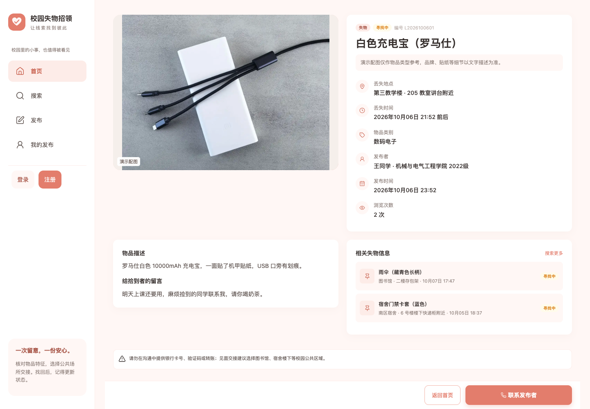
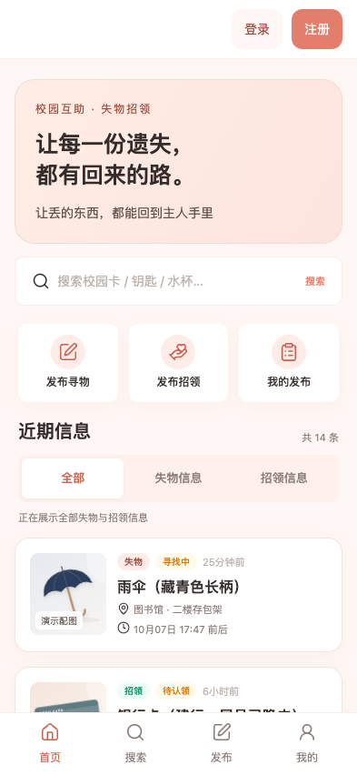
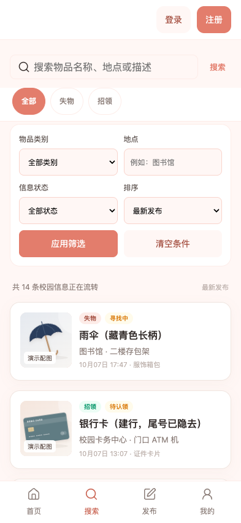
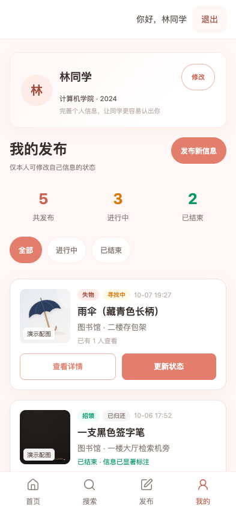
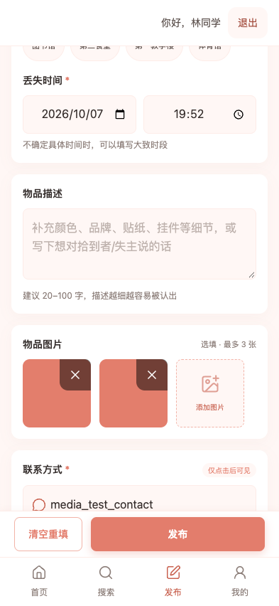
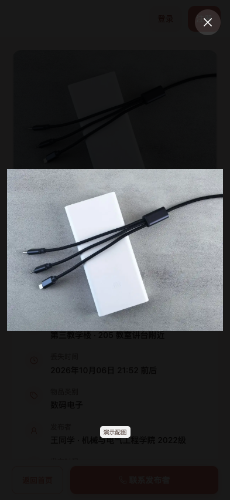
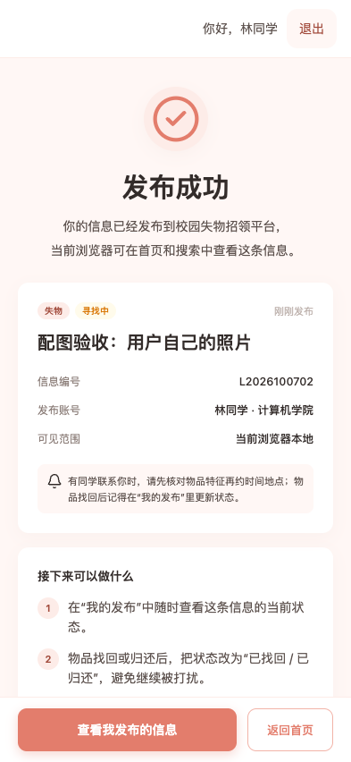

# 图标与物品配图优化记录

> 截图版本说明：本次邮箱登录回归误沿用 `素材验收-` 前缀，9 张同名截图已更新为 2026-10-07 的登录版本。下文测试数与原 JSON 保留为先前验收记录，不能用更新后的图片推断旧版界面。当前结果见 [离线登录与验证](离线登录与验证.md)。脚本已支持独立截图前缀。

日期：2026-10-07。范围仅为 `lost-found`，保留珊瑚橙主题、原有响应式断点、品牌标志与首页插画。

## 已完成

- 六个页面、导航和全局弹窗使用本地 Lucide SVG 图标；覆盖搜索、发布、联系方式、地点时间、上传删除、关闭、状态、空结果及成功提示。
- 14 条演示信息独立配图：8 张实物参考照片、6 张具体物品 SVG 示意图。雨伞不再使用箱包图，充电宝不再使用耳机图。
- 列表、详情与大图预览使用同一套图片结果。演示素材显示“演示配图”，详情说明图片只作物品类型参考；用户图片不显示该标记。
- 新照片共约 431KB，最长边不超过 1200px，单张均不超过 200KB。照片、图标与示意图均为本地文件。
- 原有分类 SVG 用作无图和加载失败时的占位；占位也失败时显示内联图标和提示，停止重试，并取消失效图片的预览操作。
- 上传区采用统一图标，保留最多三张、压缩、删除、预览和发布行为。纯图标按钮补齐可访问名称，装饰 SVG 不重复朗读。

素材清单、作者、固定上游版本与许可证见 [来源说明](../assets/SOURCES.md)。原有 PNG、分类 SVG、截图与种子数据保留。

## 接口与旧数据兼容

`LF.icons.render(name)` 从固定白名单输出装饰 SVG；未知名称回退为物品图标，不插入外部传入的 SVG 内容。

`LF.media.resolve(item)` 对数据库原始物品对象执行只读解析，返回 `{ images, coverImageUrl, mediaKind }`。`mediaKind` 为 `demo`、`upload` 或 `placeholder`，通过列表与详情接口传到页面；既有图片字段的类型和意义保持兼容。

演示匹配同时检查原始数字 ID、名称、类别、类型和完整旧图片数组。保留旧的 `seed.js` 作为匹配依据。只要图片已更换，或记录是新增同名物品，就不套用演示素材。无须修改 `lf_local_db_v1` 或要求用户重置数据；素材解析与列表读取不会改写已保存的记录。详情浏览量仍按原有业务逻辑更新。

`LF.ui.imageHtml` 统一输出图片、配图标记和降级属性，`coverHtml` 用于列表，`lightbox(urls, index, item)` 的第三参数可选，用于传递演示标记与类别；旧的双参数调用仍可用。预览使用完整图，卡片按原布局裁切。

## 实际验证

环境：macOS，Google Chrome **154.0.8037.99**，独立临时浏览器资料。本轮测试不访问个人 Chrome 资料，测试发布记录只存在于测试浏览器上下文。

| 检查 | 结果 | 证据 |
| --- | --- | --- |
| Node 单元测试 | **80 项通过，0 失败**；原 73 项加 7 项素材兼容回归 | [测试源码](../单元测试/tests/media.test.js) |
| 原有 Chrome 业务验收 | **36 个布局场景、9 组行为检查通过**，无页面脚本错误 | [业务回归记录](图标配图业务回归.json) |
| 新增素材专项验收 | **30 个布局场景、6 组专项检查通过**；未发现外部素材请求或页面脚本错误 | [专项记录](图标配图浏览器验证.json) |
| 14 条演示信息 | 每条列表封面与详情、预览一致，图片解码成功，标记正确 | [专项脚本](../单元测试/media-browser-check.cjs) |
| 上传流程 | 上传三张→删除一张→双图预览→发布→刷新，图片内容保留且不标为演示 | 同上 |
| 图片失败 | 照片失败回退类别图；类别图也失败回退内联图标，只尝试一次 | 同上 |
| 离线 | Chrome 断网时直接打开 HTML，本地图标、照片、详情与大图预览可用 | 同上 |
| 文件验证 | SVG XML 可解析；8 张照片尺寸、体积合格；新增文档本地链接与截图引用有效 | 本地静态检查 |

布局覆盖 360×800、393×852、768×1024、1024×768、1440×1000；原有业务脚本另覆盖 852×393 横屏，以及 720 CSS px 的等效 200% 重排布局。这不是物理手机或真实浏览器缩放倍率的替代证明。

本轮遇到并修正的验收问题：Chrome 切换窗口尺寸后，截图过早捕获上一帧合成纹理；截图工具已增加字体、动画帧与短暂合成等待。损坏占位图测试重新加载文档，避免复用前一场景已解码的内存图片。没有将这些测试环境问题误报为业务通过。

### 复现命令

以下命令从 `lost-found` 执行。单元测试仅需 Node；浏览器检查还需可用的 Playwright 和 Chrome。

```bash
node --test 单元测试/tests/*.test.js

# 在已获授权的本机预览范围内启动，先确认端口空闲
node server.js 18791

# 另一个终端，截图前缀避免覆盖历史截图
LF_PREVIEW_URL=http://127.0.0.1:18791 LF_SCREENSHOT_PREFIX=图标配图- node 单元测试/browser-check.cjs
LF_PREVIEW_URL=http://127.0.0.1:18791 node 单元测试/media-browser-check.cjs
```

本次使用应用自带的 Node 和 Playwright，未安装依赖；验收结束后已停止本次 `127.0.0.1:18791` 预览服务。上述浏览器脚本会写入本轮截图，专项脚本还会更新对应 JSON 验收记录。

## 页面截图

以下是本轮 Chrome 实际运行截图；上传和成功页面含自动测试生成的色块图片及测试名称，不是用户真实发布。





<p>
  
  
  
</p>
<p>
  
  
  
</p>

## 验证边界

- **未运行**真实手机、移动端软键盘和 Safari 验证。
- 网络照片只用于演示，不能用于核对真实物品的型号、品牌或独有特征；证件示意图不包含真实身份信息，也没有自动脱敏能力。
- 保持本地演示模式，数据不跨设备共享。本轮未修改上级前后端，未提交、推送、部署或重新打包。
