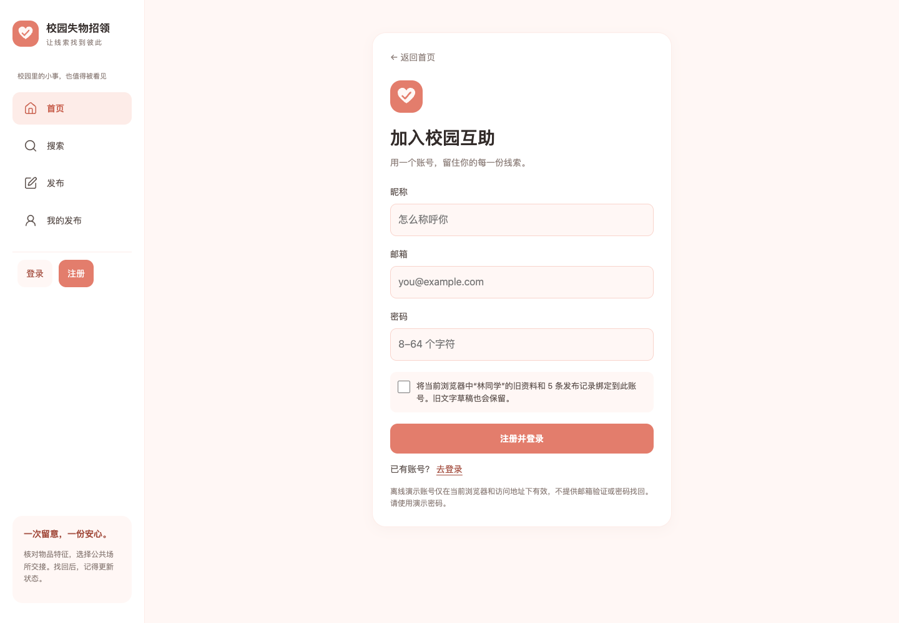
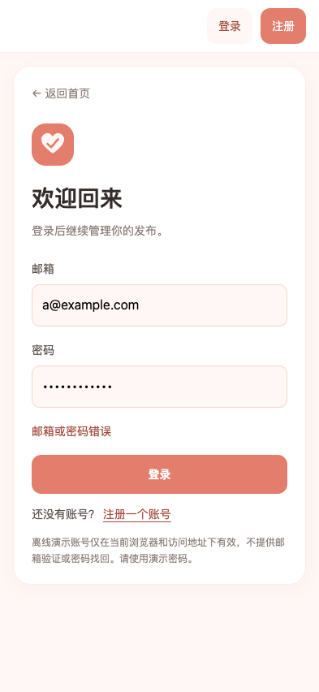
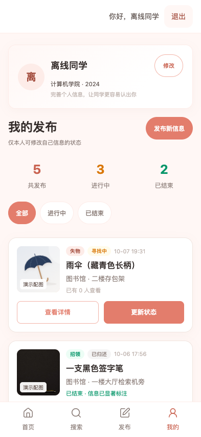

# 离线登录与验证

日期：2026-10-07。范围为 `lost-found`；未修改上级 Java 后端、原型材料，未提交或推送代码。

本文保留初次邮箱登录实现及其历史验收记录。当前登录入口已统一为原地弹窗，独立 `#/auth` 地址仍可使用；最新交互与验证见 [原地登录弹窗验证](原地登录弹窗验证.md)。下方 97 项测试及截图属于初次账号功能验收。

## 功能与接口

参照上级仓库的邮箱注册、登录和退出流程，保留当前原生前端与离线数据层。新增 `#/auth?mode=login|register&next=...`，登录成功返回站内目标；没有有效目标时进入“我的发布”。桌面导航直接使用完整的“我的发布”，不再拼接后缀；手机导航保留“我的”。桌面侧栏以及手机、平板账号栏提供登录、注册、昵称和退出入口。

游客可以浏览首页、搜索和详情；发布、个人资料、我的发布、状态更新、上传图片与联系方式需要有效会话。取消匿名自动登录和登录失败后匿名重试。退出或过期时清除个人页、表单视图与浮层；业务请求保留发起时的会话标识，身份变化后拒绝迟到的读写。离开登录页会取消尚未完成的账号操作。

| 本地接口 | 输入 / 行为 |
| --- | --- |
| `LF.api.register` | `{ email, password, nickname, bindLegacy }`；首次绑定须传 `bindLegacy: true`，返回凭证与用户资料 |
| `LF.api.login` | `{ email, password }`；返回凭证与用户资料，不自动注册 |
| `LF.api.logout` | 清除当前标签页会话；清除失败时报错 |
| `LF.auth.getUserInfo / getToken` | 从有效会话读取当前身份；忽略旧匿名 `token / userInfo / currentUserId` |
| `LF.draft.load / save / clear` | 只操作当前账号的文字草稿；保存与绑定沿用数据库事务回滚机制 |

注册邮箱去除首尾空格、转小写，最长 254 字符且格式有效；昵称 1–30 字，密码 8–64 字符，密码保留原始空格。重复邮箱不能注册；登录错误统一显示“邮箱或密码错误”。密码使用 Web Crypto PBKDF2-HMAC-SHA-256、600,000 次迭代、16 字节随机盐和 256 位校验值，不记录明文密码。不支持 Web Crypto 时提示错误，不降级为明文或简单哈希。

会话采用 32 字节随机标识，存入 `sessionStorage`，24 小时过期，刷新恢复；关闭标签页后重新登录。应用每 30 秒及窗口恢复焦点时检查过期状态。浏览器可能复制原标签页的 sessionStorage 到“复制标签页”，这一行为不等于服务器多设备登录能力。

## 旧数据与演示边界

继续使用 `lf_local_db_v1`，不重建旧数据库。首次注册绑定旧 `webCode` 对应用户，或旧当前用户；全新浏览器使用原“林同学”演示用户。注册界面明确展示旧昵称和记录数量，须勾选确认后绑定；保留用户编号、学院、年级、头像、发布者关系与原有上传图片。注册填写的昵称成为新账号昵称，后续账号从空发布列表开始。

旧 `lf_publish_draft_v1` 的文字草稿在注册事务中导入对应用户的 `drafts`，排除图片和协议勾选；旧存储键保留，但不再用于其他账号。注册、绑定、资料与发布写入失败时恢复旧数据库和会话，不能显示成功。数据库损坏或版本不兼容时保留原内容并报错，不自动覆盖演示库。

这仍是单机离线演示。账号、信息、图片和草稿保存在当前浏览器与访问地址下；HTTP 和本地 HTML 的数据空间独立。清除网站存储会丢失本地数据；没有邮箱验证、密码找回或跨设备共享。可以修改本地存储或脚本的人仍能绕过权限，不能将其作为真实后端认证。

## 实际验证与复现

- Node 内置测试：**97 项通过，0 失败**，包括原有发布、状态、个人资料、搜索、配图回归，以及账号规范化、密码空格与盐、字段边界、重复注册、错误密码、刷新、退出、过期、隔离、绑定、存储失败、旧数据损坏和迟到请求。
- 独立 Google Chrome 验收：游客浏览、联系方式拦截、注册返回详情、错误密码、刷新、账号切换、草稿隔离、迟到资料响应、过期清理及断网直接打开 HTML 的注册登录退出；页面脚本错误为 0，无外部业务请求。
- 登录／注册页面覆盖 360×800、393×852、768×1024、1024×768、1440×1000，共 10 个布局场景。原有页面业务回归另覆盖 36 个布局场景，配图回归覆盖 30 个布局场景。
- 历史验收记录：[账号与布局](登录浏览器验证.json)、[配图回归](登录配图浏览器验证.json)。业务回归日志 `browser-check-登录回归.log` 仅在本机保留，不随仓库上传；当前提交前验证见 [审查记录](提交前审查与验证.md)。

从 `lost-found` 执行：

```bash
node --test --test-reporter=spec 单元测试/tests/*.test.js

# 可选：需已有 Google Chrome 和 Playwright。
# 此脚本自动启动仅监听本机随机端口的临时静态服务，退出时关闭。
node 单元测试/auth-browser-check.cjs
```

Playwright 不在默认路径时，通过 `LF_PLAYWRIGHT_PATH` 指定已有包的路径。测试使用独立临时浏览器上下文，不读取个人 Chrome 资料或已有账号。应用运行和 Node 单元测试不需要安装 Playwright。本次使用应用自带 Node 与 Playwright，未安装依赖。

**未运行**真实手机、软键盘、Safari、Firefox、双设备测试和生产环境验证。手机截图来自 Chrome 模拟视口。验收结束后关闭临时浏览器和静态服务。

## 截图及历史文件说明

以下是本次实际 Chrome 截图，昵称、邮箱及发布内容均为测试数据。



<p>
  
  
  
</p>

配图回归第一次运行沿用了旧脚本的 `素材验收-` 前缀，更新了 9 张同名旧截图；没有找到本地备份，无法还原旧图。已修正脚本读取独立前缀，后续使用 `登录配图回归-`，原 JSON 验收记录保持不变。旧配图报告已标明图片版本，不能用这些新截图证明旧版页面。此次问题只影响历史验收图片，不涉及用户发布数据或原始物品素材。
