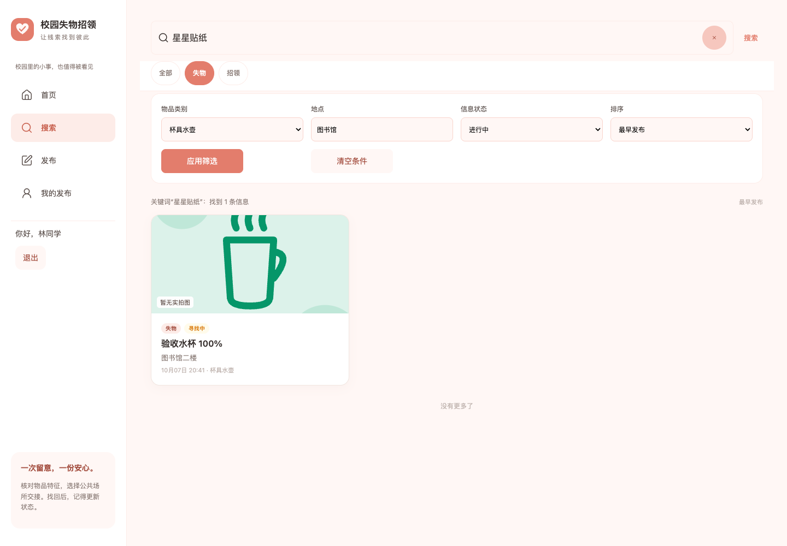
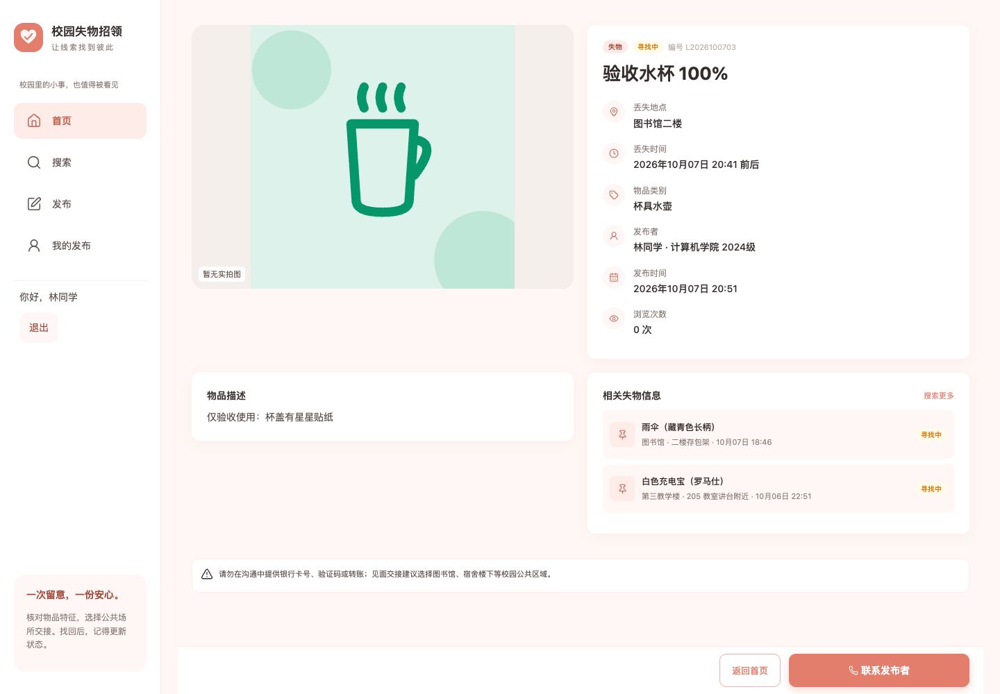
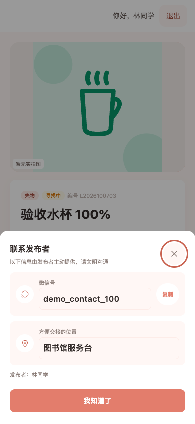
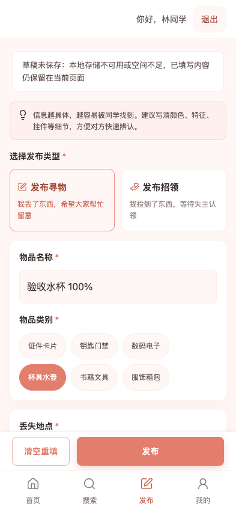
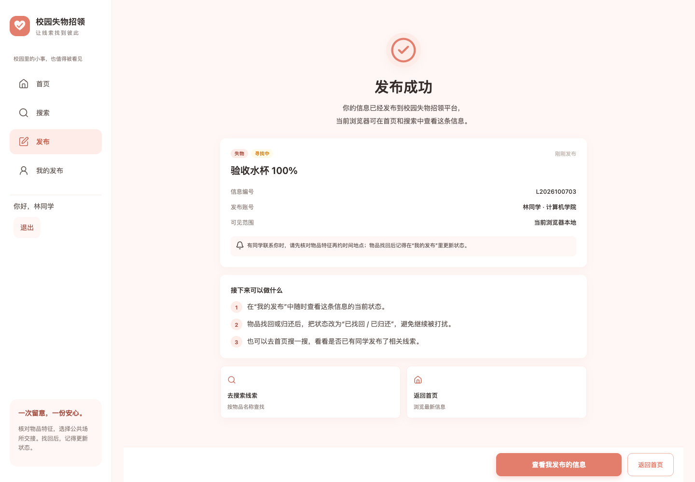
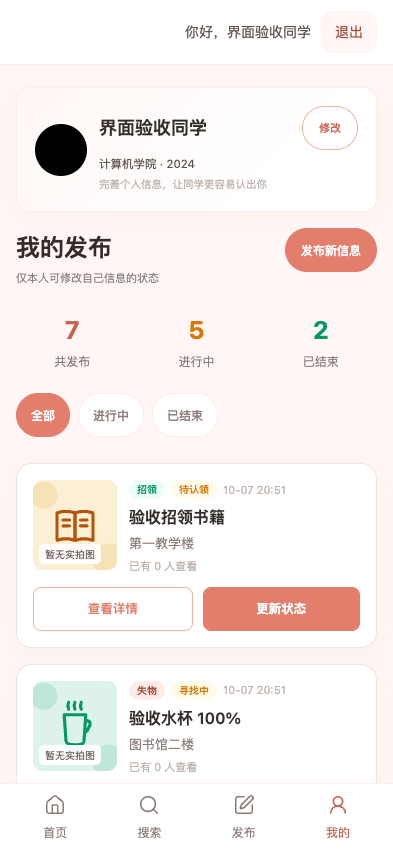
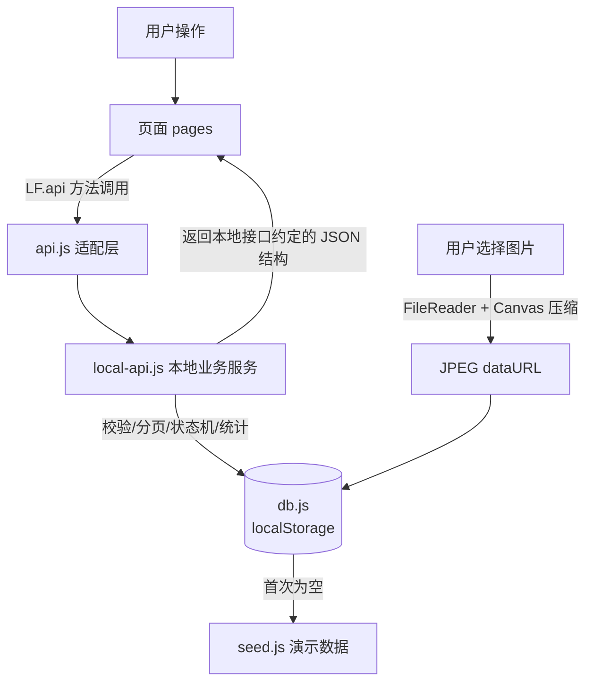
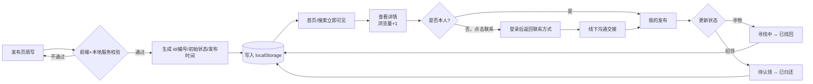
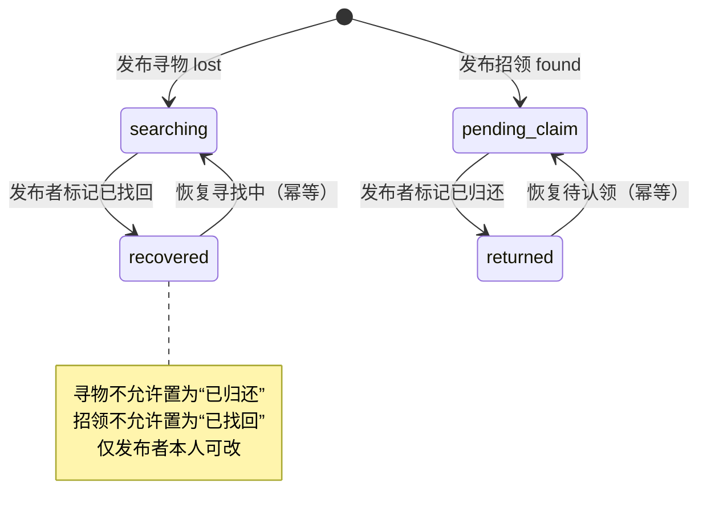

# 软件工程第二次结对作业

| 项目                 | 内容                                                         |
| -------------------- | ------------------------------------------------------------ |
| 这个作业属于哪个课程 | [首页 - H202601软件工程与软件工程实践 - 福州大学 - 班级博客 - 博客园](https://edu.cnblogs.com/campus/fzu/2026-01SoftwareEngineeringandSoftwareEngineeringPractice?filter=homework) |
| 这个作业要求在哪里   | [2026秋软件工程结对作业（第二次之程序实现）- H202601软件工程与软件工程实践 - 班级博客 - 博客园](https://edu.cnblogs.com/campus/fzu/2026-01SoftwareEngineeringandSoftwareEngineeringPractice/homework/16745) |
| 这个作业的目标       | 实现校园失物招领 Web 离线演示版的核心功能 |
| GitHub 项目地址      | [5-bin/102401632-102401633](https://github.com/5-bin/102401632-102401633) |
| 姓名                 | 待填真实姓名 |
| 学号                 | 待填本人学号；仓库名含两个学号，但不据此推断人员对应关系 |
| 合作伙伴             | 待填真实姓名、学号 |
| 结对同学博客         | 待填真实博客链接 |
| 本次作业博客         | 发布后填真实链接 |

> 本文是待完善的交付草稿。分工、PSP、学习过程、结对经历和个人评价需由两位同学按真实情况确认；技术实现由代码核对，测试结论以实际运行和明确标注的历史记录为依据。

---

## 一、具体分工

以下保留原草稿的模块分工，**尚未确认真实执行情况**，正式交付前应按双方实际贡献替换。

| 成员 | 主要分工 |
| --- | --- |
| 【姓名 A】 | 原型走查与需求梳理；本地数据层（`seed.js` / `db.js`）；列表、搜索、详情页；单元测试用例设计与测试框架搭建；博客撰写 |
| 【姓名 B】 | 发布、发布成功、我的发布、个人资料页；状态流转与权限校验；图片本地压缩；样式与交互联调；回归测试与 README |

实际协作方式、讨论记录、驾驶员／领航员轮换和各自贡献：**待双方填写真实过程与依据**。模块分工草案不能证明两人已经按上述方式结对完成。

---

## 二、项目展示

以下复用 2026-10-07 已存在的 Chrome 自动验收截图，来源为 [原地登录弹窗验证记录](docs/原地登录弹窗验证.md)。物品与账号是演示／验收数据；这些截图不代表本次重新运行了完整验收，也不证明真实手机通过。发布博客时须上传图片并替换为实际图床地址。









## 三、PSP 表格

**以下数值来自原草稿，预估与实际耗时均未获双方确认。** 本次仅核对算术，保留原有数值供核实；正式提交前须根据真实记录替换，不能将该表作为已确认的个人耗时。

| PSP2.1 | 阶段 | 预估耗时 | 实际耗时 |
| --- | --- | ---: | ---: |
| Planning | 计划 | 20 | 25 |
| Estimate | 估计任务所需时间 | 20 | 20 |
| Development | 开发 |  |  |
| Analysis | 需求分析（含学习新技术） | 90 | 110 |
| Design Spec | 生成设计文档 | 60 | 70 |
| Design Review | 设计复审 | 30 | 35 |
| Coding Standard | 制定代码规范 | 25 | 20 |
| Design | 具体设计（数据结构/接口契约/状态机） | 90 | 120 |
| Coding | 具体编码 | 300 | 360 |
| Code Review | 代码复审 | 60 | 80 |
| Test | 测试（自测、改代码、提交） | 120 | 180 |
| Reporting | 报告 |  |  |
| Test Report | 测试报告 | 40 | 50 |
| Size Measurement | 计算工作量 | 20 | 20 |
| Postmortem & Process Improvement Plan | 事后总结与改进计划 | 30 | 40 |
| **合计（未核实草稿）** |  | **905** | **1130** |

**算术核对**：原草稿明细合计为预估 905 分钟、实际 1130 分钟，差值 225 分钟。真实偏差及原因：**待双方结合实际记录填写**，不将原草稿中的返工描述当作已确认经历。

---

## 四、解题思路与设计实现

### 4.1 代码实现思路

题目要求实现"**发布信息 → 浏览或搜索 → 查看详情 → 联系发布者 → 更新状态**"的闭环。我们沿用第一次作业的原型，做成一个移动端风格的 Web 单页应用（hash 路由），页面包括：首页、搜索、发布、详情、发布成功、我的发布。

考虑到评分要求"**其他同学下载所有文件后，用 Chrome 运行 html 就能看到预期结果**"，如果依赖 Spring Boot + MySQL，测试同学还要装 JDK、初始化数据库、启动后端、处理端口和跨域，复现门槛高、容易翻车。因此我们做了一个工程上的取舍：

- 页面通过统一的 `LF.api` 调用业务方法，采用 Promise 和本地版约定的字段、分页结构；
- 但把"后端"以一个**浏览器内本地数据层**的形式实现：`js/data/local-api.js` 承载全部业务规则，`js/data/db.js` 用 `localStorage` 持久化，`js/data/seed.js` 提供开箱即用的演示数据；
- 页面依赖 `LF.api` 的本地方法签名与返回结构。现有 Java 后端的账号认证、字段、类别与状态枚举、分页、图片上传协议均有差异；接入前必须实现这些转换，并检查页面调用与错误处理。不能只替换转发目标或接口地址就宣称完成后端接入。

整体分层如下：

```
页面 pages/*.js（首页/搜索/发布/详情/我的发布）
        │  只调用 LF.api.xxx()，返回 Promise
        ▼
js/utils/api.js（接口集合，适配层）
        │  当前转发给本地实现；接后端时需新增协议转换
        ▼
js/data/local-api.js（业务规则：校验/状态机/分页/搜索/统计/联系方式）
        ▼
js/data/db.js（localStorage 数据库：主键、编号、持久化）
        ▼
js/data/seed.js（首次打开写入的演示数据）
```

### 4.2 流程图

**（1）总体数据流（分层与依赖）**



**（2）核心业务流程：发布 → 浏览/搜索 → 详情 → 联系 → 更新状态**



**（3）信息状态机（状态迁移测试的依据）**



### 4.3 重要代码片段

**① 适配层：页面不感知数据来源（`js/utils/api.js`）**

```js
(function (LF) {
  var api = LF.localApi;
  // 转发当前本地业务服务；Java 后端接入另需协议适配。
  LF.api = {
    register: api.register,
    login: api.login,
    logout: api.logout,
    getItems: api.getItems,
    searchItems: api.searchItems,
    getItemDetail: api.getItemDetail,
    getItemContact: api.getItemContact,
    createItem: api.createItem,
    updateItemStatus: api.updateItemStatus,
    getMyItems: api.getMyItems,
    getCurrentUser: api.getCurrentUser,
    updateCurrentUser: api.updateCurrentUser,
    uploadImage: api.uploadImage
  };
})(window.LF);
```

意义：页面通过统一接口调用本地业务，避免自行读写数据库。统一调用入口便于集中实现后端适配，但不代表本地协议与 Java 后端协议相同。

**② 状态机 + 所有权校验（`js/data/local-api.js` 的本地方法，不是当前已接入的 HTTP 接口）**

```js
var ALLOWED_STATUS = {
  lost: ['searching', 'recovered'],
  found: ['pending_claim', 'returned']
};
function updateItemStatus(id, status) {
  return protectedCall(function () {
    var me = requireUser();                 // 必须登录
    var item = findItem(id);
    if (!item) throw new Error('信息不存在或已被删除');
    if (item.publisherId !== me.id) throw new Error('只能操作本人发布的信息'); // 越权拦截
    if (ALLOWED_STATUS[item.type].indexOf(status) === -1) {
      throw new Error('非法的状态变更，请刷新后重试');   // 跨类型状态拦截
    }
    item.status = status;                   // 幂等：重复设置同一状态也成功
    return { id: item.id, status: item.status,
             statusText: STATUS_TEXT[item.status], updatedAt: LF.db.formatTs(new Date()) };
  }, undefined, true);                     // 事务写入，保存失败时回滚
}
```

**③ 搜索：关键词同时匹配名称、地点、描述、编号（本地关键词匹配片段，完整实现还包含组合筛选与排序）**

```js
var keyword = (params.keyword || '').trim().toLowerCase();   // 先 trim
var list = currentState().items.filter(function (it) {
  if (params.type && params.type !== 'all' && it.type !== params.type) return false;
  if (!keyword) return true;                                  // 空关键词 = 全部
  var hay = [it.name, it.location, it.description || '', it.itemNo].join(' ').toLowerCase();
  return hay.indexOf(keyword) > -1;
});
```

**④ 信息编号生成（`js/data/db.js`）：寻物 `L+yyyyMMdd+序号`，招领 `F` 前缀，按天计数**

```js
function nextItemNo(st, type, date) {
  var prefix = type === 'lost' ? 'L' : 'F';
  var key = prefix + ymd(date);
  st.itemNoSeq[key] = (st.itemNoSeq[key] || 0) + 1;
  return key + pad2(st.itemNoSeq[key]);   // 例如 L2026100201
}
```

**⑤ 图片不上传服务器：本地读取 + Canvas 压缩为 dataURL（`local-api.js`）**

```js
function fileToDataUrl(file, maxEdge, quality) {
  return new Promise(function (resolve, reject) {
    var reader = new FileReader();
    reader.onload = function () {
      var img = new Image();
      img.onload = function () {
        /* 等比缩放到最长边 900，铺白底后转 JPEG，避免 localStorage 被大图撑爆 */
        var w = img.width, h = img.height;
        if (w > h && w > maxEdge) { h = Math.round(h * maxEdge / w); w = maxEdge; }
        else if (h >= w && h > maxEdge) { w = Math.round(w * maxEdge / h); h = maxEdge; }
        var canvas = document.createElement('canvas');
        canvas.width = w; canvas.height = h;
        var ctx = canvas.getContext('2d');
        ctx.fillStyle = '#ffffff'; ctx.fillRect(0, 0, w, h);
        ctx.drawImage(img, 0, 0, w, h);
        resolve(canvas.toDataURL('image/jpeg', quality));
      };
      img.src = reader.result;
    };
    reader.readAsDataURL(file);
  });
}
```

---

## 五、附加特点设计

| # | 特点 | 设计意义 | 实现方式 |
| --- | --- | --- | --- |
| 1 | **零后端、零安装、双击即跑** | 用 Chrome 可直接演示，无需 JDK／数据库；仍受浏览器存储限制 | 浏览器内本地数据层 + localStorage；后端接入需另做协议适配 |
| 2 | **图片本地压缩** | 不上传服务器也能发图，且避免大图撑爆浏览器存储 | FileReader + Canvas 等比缩放至 900px、转 JPEG dataURL |
| 3 | **联系方式一键复制 / 拨打、且按需可见** | 登录后点击才展示联系方式；本地展示控制不能替代服务器隐私鉴权 | `getItemContact` 本地方法 + Clipboard API（含降级方案）；手动复制交互尚有审查待办 |
| 4 | **证件类隐私提示 + 敏感信息不直接展示** | 呼应原型隐私设计，降低学号/卡号泄露风险 | 详情页对 `id_card` 类别显示专门隐私提示，种子数据对卡号做了脱敏 |
| 5 | **演示数据一键重置 + 相对时间** | 任何时候打开都有完整可演示数据；"刚刚/x 分钟前"随时间自然 | seed 时间用"距当前分钟数"动态生成；提供 `LF.localApi.resetDemo()` |
| 6 | **表单与状态校验、空结果引导** | 必填、未来时间、图片超限、无搜索结果、越权、非法状态均有提示 | 本地业务层二次校验 + 页面引导；不是服务器权限保护 |

---

## 六、目录说明与使用说明

### 6.1 项目结构

```
lost-found/
├─ index.html                 # 单页应用入口（hash 路由，按序加载脚本）
├─ server.js                  # 零依赖 Node 静态服务器（可选）
├─ README.md                  # 项目说明与运行方式
├─ LICENSE                    # 项目代码 MIT 许可证
├─ docs/                      # 课程要求、历史截图、验证记录和提交前审查
├─ assets/
│  ├─ tabbar/                 # 历史导航 PNG，保留
│  ├─ icons/lucide/           # 当前本地图标与第三方许可证
│  └─ items/                  # 分类 SVG、实物参考照片和物品示意图
├─ css/                       # 全局、页面、响应式、登录和配图样式
├─ js/
│  ├─ config.js               # 全局配置（已去除后端地址）
│  ├─ app.js                  # 路由与启动入口
│  ├─ data/                   #
│  │  ├─ seed.js              #   演示数据
│  │  ├─ db.js                #   localStorage 数据库 / 主键 / 编号
│  │  ├─ accounts.js          #   邮箱注册登录、密码校验、会话与旧资料绑定
│  │  └─ local-api.js         #   本地业务、组合搜索、状态和失败回滚
│  ├─ utils/                  # api、auth、draft、query、icons、media 及展示工具
│  ├─ components/tabbar.js    # 桌面／平板／手机导航
│  └─ pages/                  # auth/home/search/publish/detail/publish-success/my-posts
└─ 单元测试
   ├─ package.json            # npm test 入口（零第三方依赖）
   └─ tests/
      ├─ helpers/env.js       # 浏览器环境垫片（vm + 内存 localStorage）
      ├─ accounts.test.js     # 注册、会话、账号隔离、旧资料绑定和失败回滚
      ├─ auth-navigation.test.js # 登录目标、弹窗续接及会话事件
      ├─ local-api.test.js    # 核心业务测试
      ├─ db.test.js           # 数据库工具测试
      ├─ media.test.js        # 配图映射、上传图片保留与白名单
      ├─ responsive-features.test.js # 组合搜索、排序、草稿和事务回滚
      └─ utils.test.js        # 时间/图片地址工具测试
```

### 6.2 如何运行

**运行程序（二选一）：**

从仓库根目录操作：

1. 直接用 Chrome 打开 `index.html`；
2. 或安装 Node 后执行 `node server.js`，浏览器访问 `http://localhost:8090`。

首页、搜索和详情允许游客浏览；发布、我的发布、联系方式及个人资料需要先注册／登录。账号、发布记录、图片和草稿只保存在当前浏览器和访问地址下；会话在 sessionStorage，24 小时过期。不提供跨设备共享或密码找回。静态服务器的路径检查与非法 URL 处理尚有待修问题，见 [审查记录](docs/提交前审查与验证.md)。

---

## 七、单元测试

### 7.1 测试工具选型、学习过程与简易教程

**选型**：作业附录推荐了 Mocha，本项目实际采用 **Node.js 内置测试运行器 `node:test` + 内置断言 `node:assert/strict`**。选用理由如下；两位同学的真实学习过程另需补充。

- **零第三方依赖**：Node ≥ 18 自带测试运行器；没有 npm 时也能用 `node --test tests/*.test.js` 运行；
- **便于自动化**：当前入口运行 `tests/*.test.js`，退出码反映成败，可用于后续构建检查；
- **用例组织清楚**：使用 `describe / it / beforeEach` 组织测试套件、用例和初始化。迁移测试框架仍需核对具体 API 和执行行为。

**建议学习路径**：先理解断言、测试套件、钩子、异步测试和用例隔离，再结合本项目用例理解 `node:test` 与 `assert` 的用法。实际阅读资料、练习和困难：**待双方填写**。

**一份你自己的简易教程：**

1. **环境**：安装 Node 18+（命令行 `node -v` 能看到版本即可），测试框架不用 `npm install`。
2. **写测试**：新建 `tests/xxx.test.js`，文件名以 `.test.js` 结尾，Node 会识别为测试文件：

   ```js
   const { describe, it, beforeEach } = require('node:test');
   const assert = require('node:assert/strict');

   describe('被测模块', () => {
     it('应当满足某性质', () => {
       assert.equal(1 + 1, 2);           // 同步断言
     });
     it('异步接口用 await', async () => {
       const data = await someAsync();
       assert.ok(Array.isArray(data.records));
     });
   });
   ```

3. **跑测试**：`node --test tests/a.test.js tests/b.test.js`，或在 `package.json` 配
   `"scripts": { "test": "node --test tests/*.test.js" }` 后执行 `npm test`。
4. **看结果**：`# pass / # fail` 汇总，失败会给出期望值/实际值与代码位置；进程退出码非 0 表示有失败，可被 CI/每日构建识别。
5. **用例隔离**：每个用例在 `beforeEach` 里构造全新的内存数据库，互不污染、可重复运行。

### 7.2 单元测试代码展示与被测函数说明

2026-10-07 对当前本地版本执行 `node --test tests/*.test.js`：**7 个测试文件、100 项测试全部通过，18 个套件，0 失败**。被测函数与对应文件：

| 测试文件 | 被测对象 | 覆盖的函数/接口 |
| --- | --- | --- |
| `local-api.test.js` | 本地业务服务 | `login`、`getItems`、`searchItems`、`getItemDetail`、`getItemContact`、`createItem`、`updateItemStatus`、`getMyItems`、`getCurrentUser`、`updateCurrentUser`、`uploadImage` |
| `db.test.js` | 数据库工具 | `detectContactType`、`formatTs`、`nextItemNo`、`save/load/resetDemo` |
| `utils.test.js` | 纯工具 | `format.parseDate/formatDateTime*/formatRelative`、`urlUtil.resolveImageUrl(s)` |
| `accounts.test.js` | 邮箱账号与会话 | 注册登录、校验、到期、账号隔离、旧资料绑定、取消迟到请求及存储失败回滚 |
| `auth-navigation.test.js` | 登录续接 | 登录目标白名单、弹窗回调、退出与到期事件 |
| `responsive-features.test.js` | 组合搜索与持久化 | 组合筛选、排序分页、草稿、事务回滚及特殊 URL 参数 |
| `media.test.js` | 图片映射与安全边界 | 演示配图、用户图片优先、读取不污染数据及图标白名单 |

**示例 1：状态迁移 + 权限（白盒）**

```js
it('发布者可把寻物标记为已找回，文案正确并带更新时间', async () => {
  const created = await LF.api.createItem(validPayload(LF));
  const res = await LF.api.updateItemStatus(created.id, 'recovered');
  assert.equal(res.status, 'recovered');
  assert.equal(res.statusText, '已找回');
  assert.ok(res.updatedAt);
});
it('权限：不能修改他人发布的信息', async () => {
  await assert.rejects(LF.api.updateItemStatus(2, 'returned'), /本人|权限/);
});
it('非法状态迁移：寻物不能置为“已归还”', async () => {
  const lost = await LF.api.createItem(validPayload(LF, { type: 'lost' }));
  await assert.rejects(LF.api.updateItemStatus(lost.id, 'returned'), /状态/);
});
```

**示例 2：分页边界值（pageSize 钳制 1~20、非法页码归一）**

```js
it('pageSize 超过 20 被钳制为 20，非法页码归一到第 1 页', async () => {
  const big = await LF.api.getItems({ page: 1, pageSize: 999 });
  assert.equal(big.pageSize, 20);
  assert.equal(big.records.length, 14);
  const zero = await LF.api.getItems({ page: 0, pageSize: 0 });
  assert.equal(zero.page, 1);
  assert.equal(zero.pageSize, 10);
});
```

**示例 3：测试环境垫片（让浏览器脚本跑在 Node 里）**

```js
// 在异步测试用例回调内复用实际环境助手，避免漏掉账号服务的依赖。
const { createEnv, loginDemo } = require('./helpers/env');
const { LF } = createEnv(); // vm + 独立 localStorage/sessionStorage + Web Crypto
await loginDemo(LF);       // 受限业务用例先注册／登录演示账号
```

完整运行结果（实际执行输出）：

```
# tests 100
# suites 18
# pass 100
# fail 0
```

### 7.3 测试数据构造思路，以及如何应对"刁难"

我们以**白盒设计方法**为主来构造用例，先读代码理清分支与边界，再逐条覆盖：

- **等价类划分**：类型（失物/招领）、登录态（本人/他人/匿名）、联系方式（微信/手机号）、搜索（命中名称/地点/描述/无命中）。
- **边界值分析**：分页 `pageSize` 取 0、1、10、20、999；图片恰好/超过 3 张与 5MB；发生时间卡在"现在 +5 分钟"附近；编号同一天跨第 1、2 条；文本长度上下限。
- **状态迁移测试**：沿状态机四条合法迁移各测一次，再故意走两条非法跨类型迁移；并验证重复设置同一状态的**幂等性**。
- **权限/安全测试**：匿名拉联系方式、非发布者改状态都必须被拒绝；详情接口断言**不返回 `contactValue`**。
- **错误推测（主动刁难自己）**：关键词首尾空格、空关键词、搜不到结果、不存在的 id、漏填每一个必填项、不勾协议、未来时间、非法类别枚举、非法图片类型、刷新后数据是否还在。

**数据策略**：固定 14 条**种子数据**刻意覆盖 6 个类别、2 种类型、4 种状态（含已结束）和有无图片两种情况，保证列表/筛选/统计/推荐都有确定性结果；动态新增的数据则用 `validPayload()` 工厂函数生成、按需覆盖字段。每个用例在 `beforeEach` 中拿到**全新的内存数据库**，互不干扰、可反复运行，不依赖真实浏览器数据。

**验证边界**：100 项单元测试主要覆盖本地业务层，不证明所有页面交互正确。此前提交前审查使用独立 Chrome 上下文直接打开 HTML，确认首页在 1440／768／393 像素宽度下无横向溢出，同时复现了联系方式误关、头像上传残留遮罩和状态失败后无法重试。静态服务器问题通过隔离调用处理函数验证，未启动项目服务。本次文档修订重新运行单元测试；完整浏览器回归脚本、实机手机验收**未运行**。已知问题和历史验证区分见 [提交前审查与验证](docs/提交前审查与验证.md)。

---

## 八、GitHub 签入记录

仓库以 fork 的原有历史为基线；以下是 2026-10-07 实际读取到的最近 5 条历史提交，不能据此推断两位同学的真实分工。完整记录见 [GitHub 提交历史](https://github.com/5-bin/102401632-102401633/commits/main/)。

| 提交 | 实际提交信息 |
| --- | --- |
| `f64f22e` | fix:修复我的页面按钮问题 |
| `5de887e` | fix: 修改导航栏图标 |
| `1504aec` | test: 补充数据层与工具函数用例 |
| `d9b8206` | docs: 归档作业要求与 6 张功能成果截图 |
| `2c71249` | test: 补充登录/分页/搜索/状态迁移/权限/图片边界用例 |

课程要求的真实 Git 签入记录截图：**待双方从实际仓库页面补充**。原 [commit 记录表](commit记录.md)是未核实的任务拆分草案，不作为提交截图或真实协作证据。

---

## 九、遇到的异常 / 结对困难与解决

以下保留原草稿的技术问题分析；是否由两位同学实际经历、各自尝试及讨论记录，均需确认后再写入正式博客，不能把技术分析当作已确认的个人经历。

**问题 1：没有后端时如何模拟一个"后端"，又不让页面写死？**
- 尝试：最初想让页面直接读写 localStorage，很快发现业务规则（校验、状态机、统计）会散落在各页面，难以测试也无法对接真实后端。
- 解决：抽出 `local-api.js` 作为唯一业务出口，页面只依赖 `LF.api` 的契约；`api.js` 做适配层转发。
- 技术说明：统一业务入口便于测试和后续后端适配；接入 HTTP 后端仍需处理账号、枚举、分页、图片上传及错误协议的差异。

**问题 2：图片在没有服务器/对象存储时怎么保存？**
- 尝试：直接存 base64 原图，几张手机照片就把 localStorage（约 5MB）撑爆，写入抛异常。
- 解决：FileReader 读入后用 Canvas 等比压缩到最长边 900px、铺白底转 JPEG dataURL，并对存储写入做 try/catch，给出"空间不足请减少图片"的友好提示。
- 收获：前端能力边界（存储配额）要在设计时就考虑，异常路径要给用户可理解的反馈。

**问题 3：单元测试在 Node 里加载不了浏览器脚本。**
- 尝试：直接 `require` 前端文件会报 `window/localStorage is not defined`；引入 jsdom 又要联网安装、违背"零依赖可跑"。
- 解决：用 Node 内置 `vm` 造隔离全局，提供内存版 `localStorage`，按 `index.html` 顺序加载脚本。
- 收获：分清"依赖 DOM 的视图层"和"不依赖 DOM 的业务层"，把业务逻辑写成可在任意宿主运行的纯逻辑，是可测试性的关键。

**问题 4：测试断言报"结构相同但引用不等"。**
- 尝试：`deepStrictEqual` 比较 vm 沙箱里产生的数组/对象与测试里的字面量，值一样却失败。
- 定位：vm 是独立的 JS realm，沙箱内对象的原型（`Array.prototype`/`Object.prototype`）与测试主上下文不同，严格深比较会校验原型。
- 解决：对跨 realm 的复合值，用 `Array.from(...)` 转回主上下文数组、或逐字段 `assert.equal` 比较，而非整体 `deepStrictEqual`。
- 收获：理解了 JS realm 与原型身份，断言失败时要读 expected/actual 与 operator，而不是怀疑业务逻辑。

---

## 十、评价队友

- **值得学习的地方**：待填写真实事例。
- **需要改进的地方**：待填写真实事例。

---

## 十一、小结

待两位同学各自填写真实收获、分工贡献、未完成事项与个人反思。项目代码采用 [MIT License](LICENSE)，第三方素材保留各自许可，见 [素材来源](assets/SOURCES.md)。
